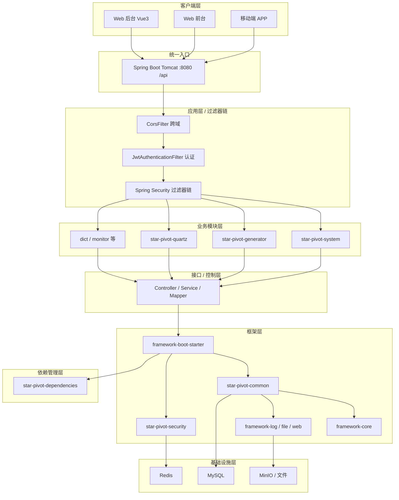
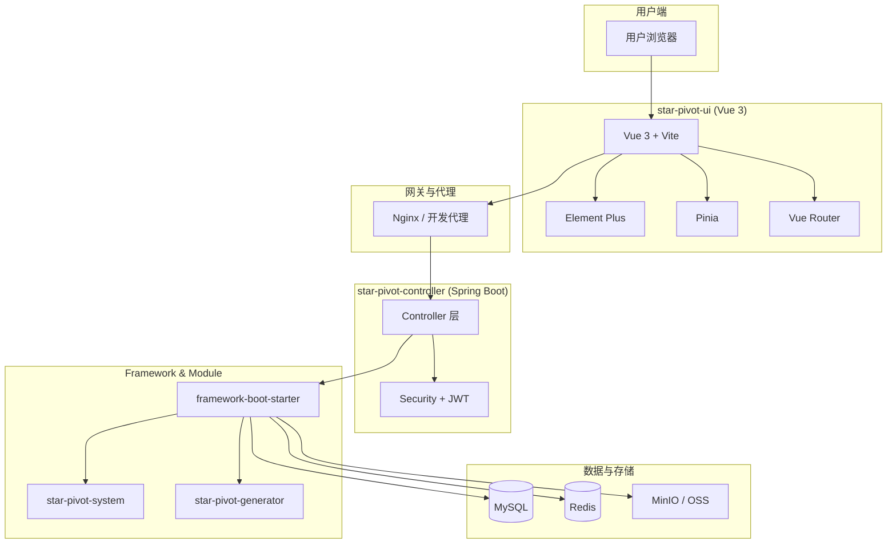
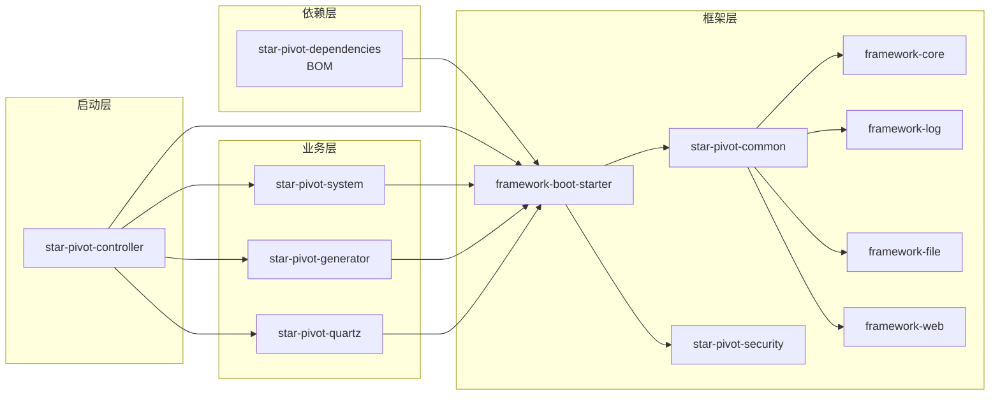
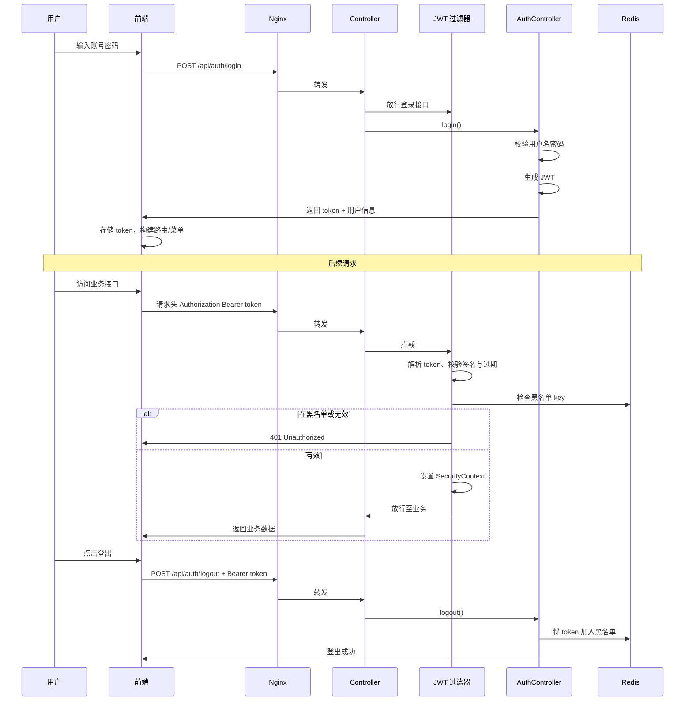
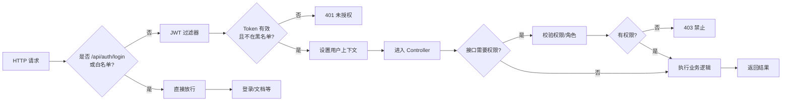

StarPivot 是基于 Spring Boot + Vue 3 的前后端分离 RBAC 管理与数据分析系统。下列内容聚焦架构、关键配置与快速上手。

---

## 1. 项目概览

### 项目简介
StarPivot 是一个现代化的企业级权限管理系统，旨在提供完整的用户认证、授权和系统管理功能。该项目适用于需要精细化权限控制的各类企业管理平台、后台管理系统和数据分析系统。

### 项目特点
- 🚀 **现代化技术栈**：采用最新的 Spring Boot 3、Vue 3 等前沿技术
- 🔐 **安全可靠**：基于 JWT 的无状态认证机制，具备令牌黑名单管理
- ⚡ **高性能**：集成 Redis 缓存，有效提升系统响应速度
- 🎨 **用户友好**：支持中英文国际化、亮色/暗色主题切换
- 📊 **数据可视化**：内置 ECharts 图表支持，便于数据分析
- 🛠️ **易扩展**：模块化设计，代码生成器支持快速开发

### 技术栈
- **后端**：Spring Boot 3.2.10、Spring Security 6.3.4、MyBatis-Plus 3.5.8、MySQL 9.1.0、Redis、JWT、Druid、SpringDoc OpenAPI
- **前端**：Vue 3.5.21、TypeScript 5.6.3、Vite 7.1.5、Element Plus 2.11.2、Pinia 3.0.3、Vue Router 4.5.1、Tailwind CSS 4.1.14、ECharts 6.0.0
- **工具**：Maven、pnpm 8.8.0+、Node.js 20.19.0+

### 项目结构
- **后端**：Maven 多模块架构，分层为 **star-pivot-dependencies**（依赖 BOM）、**star-pivot-framework**（框架层：common / security / boot-starter）、**star-pivot-module**（业务层：system / dict / generator / quartz / monitor 等）、**star-pivot-controller**（启动入口，依赖 framework 与各业务模块）；前端通过 HTTP 调用后端
- **前端**：独立 Vue 3 项目，通过 Axios 与后端 API 交互

### 核心功能
- ✅ 用户/角色/菜单/权限管理（RBAC）
- ✅ 部门管理（树形结构）
- ✅ 字典管理（数据字典）
- ✅ 岗位管理
- ✅ JWT 无状态认证与令牌黑名单
- ✅ 动态菜单与按钮级权限控制
- ✅ Redis 缓存优化（菜单树、字典数据）
- ✅ 文件上传（MinIO 对象存储）
- ✅ 代码生成器（基于 MyBatis-Plus Generator）
- ✅ 国际化支持（中英文）
- ✅ 主题切换（亮色/暗色）
- ✅ 数据可视化（ECharts 图表）
- ✅ API 文档（集成 SpringDoc OpenAPI）
- ✅ 系统监控与性能分析

## 2. 模块说明
- **star-pivot-dependencies**：依赖 BOM，统一管理第三方及内部模块版本。
- **star-pivot-framework**（聚合）：框架层，下含  
  - **细化子模块**
    - `star-pivot-framework-core`：核心（domain、exception、constants、sql、基础 utils、SecurityUtils）。  
    - `star-pivot-framework-log`：操作日志（@Log 注解、LogUtils 脱敏/IP/UA）。  
    - `star-pivot-framework-file`：文件存储（MinioUtil、OssUtil、MinioProperties）。  
    - `star-pivot-framework-web`：Web 抽象（LoginUserInfo 等）。  
  - `star-pivot-common`：通用层聚合（pom，依赖 core+log+file+web，保持对原 common 的引用兼容）。  
  - `star-pivot-security`：Spring Security + JWT 认证、过滤器、安全配置。  
  - `star-pivot-framework-boot-starter`：框架启动聚合（仅聚合 `star-pivot-security`，并传递 core/log/file/web）；**不含**业务模块。
- **star-pivot-module**（聚合）：业务层，下含  
  - `star-pivot-system`：领域模型（`SysUser`/`SysRole`/`SysMenu` 等）、Mapper 与 Service。  
  - `star-pivot-dict`：字典类型与字典数据。  
  - `star-pivot-generator`：代码生成器。  
  - `star-pivot-quartz`：定时任务调度。  
  - `star-pivot-monitor`：监控（API 性能切面、缓存与服务器指标等）。
- **star-pivot-controller**：启动入口、Web 配置（CORS/异常/拦截器/MyBatis-Plus/Redis）、业务 Controller（按域分包：`controller.auth` / `controller.system` / `controller.quartz` / `controller.monitor`）；依赖 `framework-boot-starter` 与各业务模块。
- **star-pivot-ui**：Vue 3 + Vite 前端，动态路由与菜单渲染，基于 Element Plus 的后台界面。

## 3. 架构图与流程图

### 3.1 分层系统架构图（从客户端到基础设施）

按「客户端 → 过滤器链 → 业务模块 → 接口/控制 → 框架层 → 依赖管理 → 基础设施」分层，详见 [doc/架构图与流程图.md](doc/架构图与流程图.md#1-分层系统架构图从客户端到基础设施)。



### 3.2 系统总体架构图



### 3.3 后端模块分层与依赖关系



### 3.4 认证与授权流程图



### 3.5 请求处理与权限校验流程



## 4. 技术与依赖管理
- 顶层 `pom.xml` 使用 Spring Boot 官方 BOM（`spring-boot-dependencies`）统一三方版本。
- 内部模块依赖通过 Maven 模块引用，不在 `dependencyManagement` 冗余声明。

## 5. 快速开始

> **首次构建说明**：依赖版本由 `star-pivot-dependencies` BOM 统一管理，**首次构建或清理后构建时，请先安装 BOM**，再编译启动模块：
> ```bash
> mvn install -f star-pivot-dependencies/pom.xml
> ```
> 然后再执行下文「后端启动」中的 `mvn -pl star-pivot-controller -am clean install`。

### 环境要求
- **后端**：JDK 17+、Maven 3.6+、MySQL 5.7+ / 8.0+、Redis 5.0+、MinIO（可选，用于文件上传）
- **前端**：Node.js 20.19.0+、pnpm 8.8.0+（推荐）或 npm/yarn

### 数据库初始化
1. 创建数据库：
```sql
CREATE DATABASE `star-pivot` DEFAULT CHARACTER SET utf8mb4 COLLATE utf8mb4_unicode_ci;
```

2. 导入 SQL 脚本：
```bash
mysql -u root -p star-pivot < sql/star-pivot.sql
```

### 后端启动
1. **配置数据库和 Redis**：编辑 `star-pivot-controller/src/main/resources/application.yml`
   ```yaml
   spring:
     datasource:
       url: jdbc:mysql://localhost:3306/star-pivot?useUnicode=true&characterEncoding=utf8&zeroDateTimeBehavior=convertToNull&useSSL=false&serverTimezone=GMT%2B8
       username: root
       password: your_password
     data:
       redis:
         host: 127.0.0.1
         port: 6379
         password: # 如有密码请填写
   ```

2. **配置 JWT 密钥**（生产环境建议使用环境变量）：
   ```yaml
   jwt:
     secret: ${JWT_SECRET:your-secret-key-here}
     expiration: 86400000 # 24小时，单位：毫秒
   ```

3. **启动应用**：
   ```bash
   # 编译并安装依赖
   mvn -pl star-pivot-controller -am clean install
   
   # 启动应用
   mvn -pl star-pivot-controller spring-boot:run
   ```
   
   或使用 IDE 直接运行 `StarPivotApplication.java`

4. 应用默认运行在 `http://localhost:8080`，context-path 为 `/api`

### 前端启动
1. **进入前端目录**：
   ```bash
   cd star-pivot-ui
   ```

2. **安装依赖**（推荐使用 pnpm）：
   ```bash
   pnpm install
   # 或使用 npm
   npm install
   ```

3. **配置环境变量**（如需要）：
   - 复制 `.env.example` 为 `.env`（如果存在）
   - 配置后端 API 地址（通常在 `vite.config.ts` 中配置代理）

4. **启动开发服务器**：
   ```bash
   pnpm dev
   # 或
   npm run dev
   ```
   
   默认运行在 `http://localhost:5173`（Vite 默认端口）

5. **构建生产版本**：
   ```bash
   pnpm build
   # 或
   npm run build
   ```

### 默认账号
- 用户名：`admin`
- 密码：admin123 

## 6. 认证与授权（Spring Security + JWT）
- 核心配置：安全配置在 **star-pivot-security** 模块，如 `star-pivot-security/src/main/java/com/star/pivot/security/SecurityConfig.java`。
- JWT 生成/解析、密钥管理（`JwtUtil`、`JwtKeyManager`）及黑名单（`JwtBlackListManager`）均统一由 **star-pivot-security** 模块提供，业务层通过依赖该模块使用，避免重复实现。
- 过滤器：`JwtAuthenticationFilter` 从 `Authorization: Bearer <token>` 解析用户，校验签名与过期，检查黑名单。
- 黑名单：`JwtBlackListManager`（Redis，key 形如 `jwt:logout:{token}`，TTL 为剩余有效期）。
- 登录：`POST /api/auth/login` -> `AuthController.login` -> 生成 JWT 返回。  
- 登出：`POST /api/auth/logout` -> 将 token 写入黑名单并清空上下文。
- 放行：`/api/auth/login` 及可选的 Swagger/Knife4j 文档路径；其余均需认证。

## 7. 缓存策略
- 开关：`@EnableCaching` + Redis。  
- 菜单树：`SysMenuServiceImpl.menuTree()` 使用 `@Cacheable(cacheNames = "menuTree", key = "'all'")`；菜单变更使用 `@CacheEvict(allEntries = true)`。  
- 字典数据：`DictDataServiceImpl.selectDictDataByType` 使用 `@Cacheable(cacheNames = "dictData", key = "#dictType")`；变更时 `@CacheEvict(allEntries = true)`。

## 8. 菜单 / 路由 / 权限映射
- 后端模型：`SysMenu`（表 `sys_menu`），字段 `path` 对应前端路由，`component` 对应前端组件路径（如 `system/user/index`），`perms` 对应按钮/操作权限。
- 角色授权：`SysRole` 通过 `sys_role_menu`、`sys_user_role` 绑定菜单与权限点。
- 登录后接口 `AuthController.getCurrentUser` 返回用户、角色、菜单/权限列表（admin 返回全量），前端据此构建动态路由和侧边菜单，控制按钮可见性。

## 9. 路由与前端约定
- 路由入口：`star-pivot-ui/src/router/index.ts`，`createWebHistory()` 模式，部署需代理兜底（如 Nginx `try_files $uri /index.html;`）。
- 静态路由：登录/注册/异常页等在 `staticRoutes`；首页常量 `HOME_PAGE_PATH = '/dashboard/console'`，应与后台菜单的主工作台一致。

## 10. 主要功能模块

### 系统管理
- **用户管理** (`SysUserController`)：用户 CRUD、启用/禁用、重置密码、分配角色
- **角色管理** (`SysRoleController`)：角色 CRUD、权限分配（菜单权限）
- **菜单管理** (`SysMenuController`)：菜单树形结构、路由配置、权限标识
- **部门管理** (`SysDeptController`)：部门树形结构、负责人管理
- **岗位管理** (`PostController`)：岗位信息管理
- **字典管理** (`DictTypeController`, `DictDataController`)：字典类型与字典数据管理

### 认证授权
- **登录/登出** (`AuthController`)：JWT 认证、获取当前用户信息、权限列表
- **路由信息** (`RouterController`)：获取用户可访问的路由菜单

### 文件管理
- **头像上传** (`AvatarController`)：基于 MinIO 或阿里云 OSS 的文件上传功能
- **MinIO 工具类** (`MinioUtil`)：提供文件上传、下载、删除等操作的便捷方法
- **OSS 工具类** (`OssUtil`)：兼容阿里云 OSS 的文件操作功能

### 代码生成
- 基于 MyBatis-Plus Generator，支持单表/树表代码生成
- 配置路径：`application.yml` 中的 `gen` 配置项

## 11. 配置要点

### 后端配置
- **接口前缀**：`server.servlet.context-path: /api`，外部调用统一 `/api/**`，Spring Security 内部匹配不含 context-path（如 `/auth/login`）
- **CORS 配置**：`cors.allowed-origins`，生产环境建议配置具体域名，开发环境可使用 `*`
- **Redis**：用于缓存与 JWT 黑名单，需确保连接信息正确
- **MinIO**（可选）：用于文件上传，配置 `minio.endpoint`、`minio.access-key`、`minio.secret-key`、`minio.bucket-name`。如需使用 MinIO，请确保已在配置文件中正确配置，并添加相应依赖。
- **MyBatis-Plus**：逻辑删除字段 `deleted`，自动填充创建/更新时间
- **日志级别**：可通过环境变量 `LOG_LEVEL`、`SQL_LOG_LEVEL` 控制

### 前端配置
- **API 代理**：在 `vite.config.ts` 中配置开发环境代理
- **路由模式**：使用 `createWebHistory()`，生产环境需配置 Nginx 路由兜底
- **环境变量**：支持通过 `.env` 文件配置不同环境变量
- **国际化**：支持中英文切换，配置文件在 `src/locales/langs/`

## 12. 项目结构

### 后端模块结构
```
StarPivot/
├── star-pivot-dependencies/         # 依赖 BOM
├── star-pivot-framework/            # 框架层聚合
│   ├── star-pivot-framework-core/   # 核心（domain、exception、constants、sql、utils）
│   ├── star-pivot-framework-log/   # 操作日志（@Log、LogUtils）
│   ├── star-pivot-framework-file/  # 文件（MinIO、OSS）
│   ├── star-pivot-framework-web/   # Web 抽象（LoginUserInfo）
│   ├── star-pivot-common/           # 通用聚合（pom，= core+log+file+web）
│   ├── star-pivot-security/        # 安全与 JWT
│   └── star-pivot-framework-boot-starter/  # 启动聚合（security + 传递依赖）
├── star-pivot-module/               # 业务层聚合
│   ├── star-pivot-system/           # 系统核心
│   ├── star-pivot-dict/             # 字典
│   ├── star-pivot-generator/       # 代码生成
│   ├── star-pivot-quartz/           # 定时任务
│   └── star-pivot-monitor/          # 监控
└── star-pivot-controller/           # 启动与 Web 层（Controller 按 auth/system/quartz/monitor 分包）
```

### 前端项目结构
```
star-pivot-ui/
├── src/
│   ├── api/                    # API 接口定义
│   ├── assets/                 # 静态资源（图片、样式）
│   ├── components/             # 组件库（表单、表格、图表、布局等）
│   ├── config/                 # 配置文件
│   ├── directives/             # 自定义指令（权限、角色）
│   ├── hooks/                  # 组合式函数（useAuth、useTable 等）
│   ├── locales/                # 国际化资源
│   ├── router/                 # 路由配置（静态路由、动态路由、路由守卫）
│   ├── store/                  # Pinia 状态管理（用户、菜单、设置等）
│   ├── types/                  # TypeScript 类型定义
│   ├── utils/                  # 工具函数（HTTP、存储、表单验证等）
│   └── views/                  # 页面视图（系统管理、仪表盘、异常页等）
├── public/                     # 公共资源
├── vite.config.ts              # Vite 配置
├── tsconfig.json               # TypeScript 配置
└── package.json                # 项目依赖
```

## 13. API 接口说明

### 认证相关
- `POST /api/auth/login` - 用户登录
- `POST /api/auth/logout` - 用户登出
- `GET /api/auth/getCurrentUser` - 获取当前用户信息（含权限列表）

### 系统管理
- `GET/POST/PUT/DELETE /api/system/user/**` - 用户管理
- `GET/POST/PUT/DELETE /api/system/role/**` - 角色管理
- `GET/POST/PUT/DELETE /api/system/menu/**` - 菜单管理
- `GET/POST/PUT/DELETE /api/system/dept/**` - 部门管理
- `GET/POST/PUT/DELETE /api/system/post/**` - 岗位管理
- `GET/POST/PUT/DELETE /api/system/dict/type/**` - 字典类型管理
- `GET/POST/PUT/DELETE /api/system/dict/data/**` - 字典数据管理

### 路由信息
- `GET /api/router/userMenuTree` - 获取当前用户的菜单树（根据用户权限）
- `GET /api/router/dynamic-routes` - 获取当前用户的动态路由列表（根据用户权限）

### 通用导入导出
- `POST /api/common/import-export/import/{businessType}` - 导入数据（需要 `system:{businessType}:import` 权限，如 `system:user:import`）
- `POST /api/common/import-export/export/{businessType}` - 导出数据（需要 `system:{businessType}:export` 权限，如 `system:user:export`）
- `GET /api/common/import-export/template/{businessType}` - 下载导入模板（需要 `system:{businessType}:import` 权限）

### 文件上传
- `POST /api/avatar/upload` - 上传头像

## 14. 部署与运维建议

### 后端部署
- **打包**：`mvn clean package -DskipTests`
- **运行**：`java -jar star-pivot-controller/target/star-pivot-controller-0.0.1-SNAPSHOT.jar`
- **环境变量**：生产环境建议通过环境变量配置敏感信息（数据库密码、JWT 密钥、Redis 密码等）
- **JVM 参数**：建议配置 `-Xms512m -Xmx1024m` 等内存参数
- **日志**：配置 `logback-spring.xml` 或使用 `logging.level` 控制日志级别
- **健康检查**：Spring Boot Actuator 提供健康检查端点（如已引入）

### 前端部署
- **构建**：`pnpm build` 或 `npm run build`，生成 `dist` 目录
- **Nginx 配置示例**：
  ```nginx
  server {
      listen 80;
      server_name your-domain.com;
      root /path/to/dist;
      index index.html;
      
      # 路由兜底，支持前端路由
      location / {
          try_files $uri $uri/ /index.html;
      }
      
      # API 代理
      location /api {
          proxy_pass http://localhost:8080;
          proxy_set_header Host $host;
          proxy_set_header X-Real-IP $remote_addr;
      }
  }
  ```

### 开发建议
- **代码规范**：后端遵循 Java 编码规范，前端使用 ESLint + Prettier + Stylelint
- **Git 提交**：前端项目支持 Commitizen 规范提交
- **模块划分**：保持使用 Spring Boot BOM，避免手动指定 Spring 相关版本；HTTP 与安全过滤器收敛在 `controller`，领域逻辑放 `system`
- **权限管理**：在团队内明确菜单字段与前端路由、`perms` 的对应关系，避免新增页面/按钮时遗漏授权
- **性能优化**：读多写少的菜单/字典接口开启缓存，变更时依赖注解自动驱逐

## 15. 常见问题排查

### 后端问题
1. **启动失败**：检查数据库连接、Redis 连接、端口占用
2. **JWT 验证失败**：检查 JWT 密钥配置、token 是否过期、是否在黑名单中
3. **权限验证失败**：检查用户角色、菜单权限配置
4. **缓存不生效**：检查 Redis 连接、`@EnableCaching` 是否启用

### 前端问题
1. **接口请求失败**：检查后端服务是否启动、CORS 配置、代理配置
2. **路由跳转 404**：检查 Nginx 路由兜底配置、路由路径是否正确
3. **权限按钮不显示**：检查 `v-auth` 指令使用、权限标识配置
4. **菜单不显示**：检查用户角色权限、菜单数据格式

## 16. 常用路径速览

### 后端关键文件
- **启动类**：`star-pivot-controller/src/main/java/com/star/pivot/StarPivotApplication.java`
- **REST Controller**：按域分包在 `com.star.pivot.controller.auth` / `system` / `quartz` / `monitor`（目录 `star-pivot-controller/.../controller/`）
- **安全配置**：`star-pivot-security/src/main/java/com/star/pivot/security/SecurityConfig.java`
- **JWT 过滤器**：`star-pivot-security/src/main/java/com/star/pivot/security/JwtAuthenticationFilter.java`
- **JWT 与黑名单**（统一由 **star-pivot-security** 模块提供）：`JwtUtil.java`、`JwtKeyManager.java`、`JwtBlackListManager.java`，路径均为 `star-pivot-security/src/main/java/com/star/pivot/security/`
- **菜单服务**：`star-pivot-system/src/main/java/com/star/pivot/system/service/impl/SysMenuServiceImpl.java`
- **用户服务**：`star-pivot-system/src/main/java/com/star/pivot/system/service/impl/SysUserServiceImpl.java`
- **配置文件**：`star-pivot-controller/src/main/resources/application.yml`

### 前端关键文件
- **路由入口**：`star-pivot-ui/src/router/index.ts`
- **静态路由**：`star-pivot-ui/src/router/routes/staticRoutes.ts`
- **API 配置**：`star-pivot-ui/src/utils/http/index.ts`
- **权限指令**：`star-pivot-ui/src/directives/core/auth.ts`
- **用户 Store**：`star-pivot-ui/src/store/modules/user.ts`
- **菜单 Store**：`star-pivot-ui/src/store/modules/menu.ts`
- **Vite 配置**：`star-pivot-ui/vite.config.ts`

## 17. 技术文档

- **架构图与流程图**：查看 [doc/架构图与流程图.md](doc/架构图与流程图.md)（含 RBAC 模型、前端路由与菜单加载、缓存流程等）
- **前端详细文档**：查看 `star-pivot-ui/README.md` 和 `star-pivot-ui/readed.md`
- **数据库设计**：查看 `sql/star-pivot.sql`
- **API 文档**：项目集成了 SpringDoc OpenAPI (Swagger UI)，提供了完整的 API 文档支持：
  - **Swagger UI**: 访问 `http://localhost:8080/swagger-ui.html` 查看交互式 API 文档
  - **API 文档地址**: `http://localhost:8080/v3/api-docs` 提供 JSON 格式的 OpenAPI 规范
  - **Knife4j 增强版**: 如果配置了 Knife4j，访问 `http://localhost:8080/doc.html` 可获得更丰富的功能

API 文档默认在开发环境下开放，生产环境中可通过配置 `security.swagger-permit-all=false` 关闭访问。

---

## 贡献指南

欢迎任何形式的贡献！如果您想为项目做出贡献，请遵循以下步骤：

1. Fork 项目
2. 创建功能分支 (`git checkout -b feature/AmazingFeature`)
3. 提交更改 (`git commit -m 'Add some AmazingFeature'`)
4. 推送到分支 (`git push origin feature/AmazingFeature`)
5. 开启 Pull Request

---

## 许可证

本项目采用 MIT 许可证 - 详见 [LICENSE](LICENSE) 文件

---

**StarPivot** - 基于 Spring Boot + Vue 3 的企业级权限管理系统