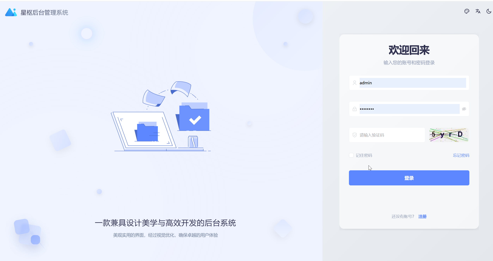
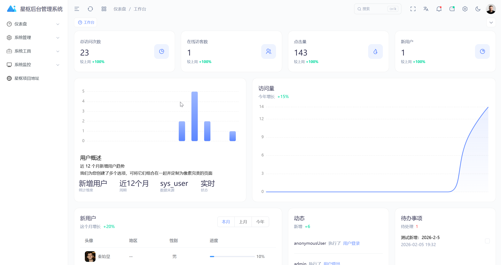
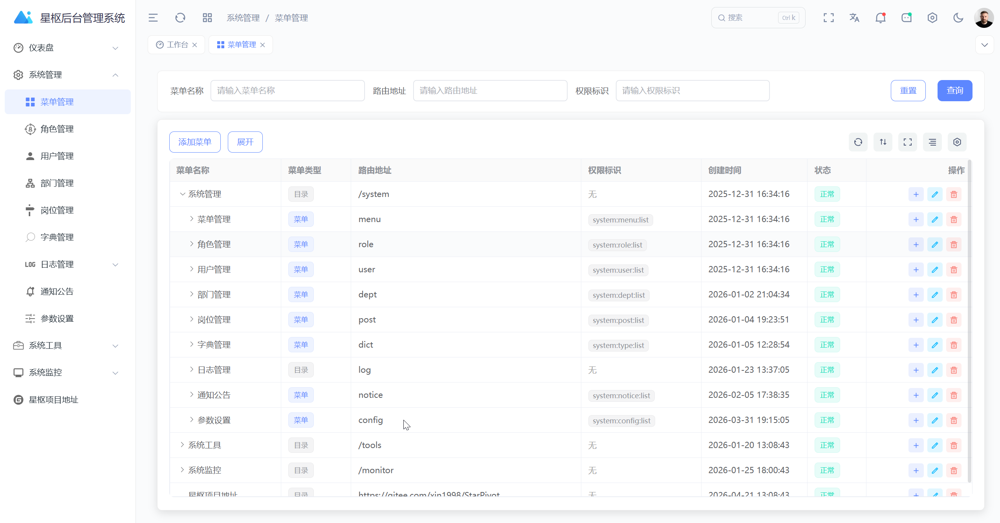
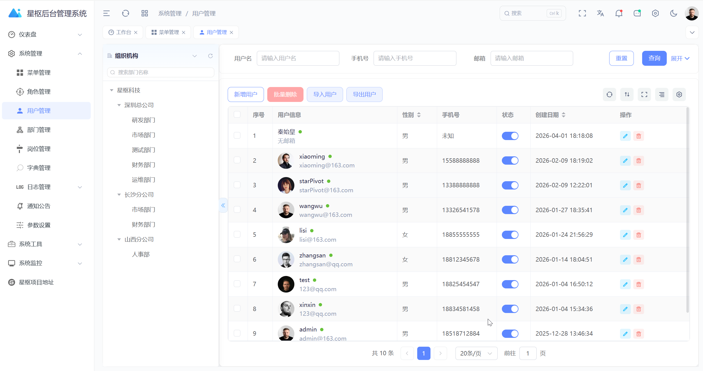

# StarPivot

> 基于 Spring Boot 3 + Vue 3 的前后端分离 RBAC 管理系统，支持动态路由、按钮级权限、JWT 鉴权、缓存优化和系统监控。

<p align="center">
  <a href="https://github.com/xinxin-star1998/star-pivot"></a>
  <a href="https://gitee.com/xin1998/StarPivot"></a>
  <a href="https://gitee.com/xin1998/starpivot-cloud"></a>
  
  
  
  <a href="./LICENSE"></a>
</p>

## 导航

- [项目简介](#项目简介)
- [相关项目](#相关项目)
- [功能亮点](#功能亮点)
- [技术栈](#技术栈)
- [快速开始](#快速开始)
- [页面预览](#页面预览)
- [文档与接口](#文档与接口)
- [部署建议](#部署建议)
- [贡献](#贡献)
- [开源治理](#开源治理)

## 项目简介

StarPivot 面向企业后台管理场景，提供一套可快速落地的权限与系统管理基础平台。  
你可以在此基础上继续扩展业务模块（如审批、报表、运营后台等），减少重复搭建后台框架的成本。

## 相关项目

本仓库为 **单体版**（Spring Boot 多模块），侧重 RBAC、系统管理与代码生成等基础能力。

若需要 **微服务架构**（Spring Cloud Alibaba、Nacos、网关、商城、审批中台、微信小程序等），请使用姊妹项目 **[StarPivot Cloud](https://gitee.com/xin1998/starpivot-cloud)**：

| 仓库 | 说明 |
|------|------|
| [Gitee · starpivot-cloud](https://gitee.com/xin1998/starpivot-cloud) | 微服务版主仓库 |
| [GitHub · starpivot-cloud](https://github.com/xinxin-star1998/starpivot-cloud) | GitHub 镜像 |

## 在线地址（可选）

- 在线演示：[https://www.starpivot.org.cn/](https://www.starpivot.org.cn/)
- 演示账号：`admin`
- 演示密码：`admin123`
- 说明：演示环境数据可能被重置，请勿录入真实敏感信息。

## 功能亮点

- 用户 / 角色 / 菜单 / 权限（RBAC）完整链路
- JWT 无状态认证 + Redis 黑名单机制
- 动态菜单、动态路由、按钮级权限控制
- 部门（树）、岗位、字典、文件中心（阿里云 OSS）
- EasyExcel 模块化导入导出（各业务独立 `/export`、`/import`、`/importTemplate`）
- 可配置用户注册（系统参数开关 + 独立限流 + 默认角色）
- MyBatis-Plus + 代码生成器，提升开发效率
- Vue 3 + TypeScript + Element Plus，支持主题和国际化
- 集成 SpringDoc OpenAPI，便于接口联调
- **AI 智能对话**（Spring AI + DeepSeek）与 **RAG 知识库**（向量检索 + 全文检索 + 重排序）

## 技术栈

**后端**

- Spring Boot 3
- Spring Security 6
- MyBatis-Plus
- MySQL
- Redis
- JWT
- Maven

**前端**

- Vue 3
- TypeScript
- Vite
- Element Plus
- Pinia
- Vue Router
- ECharts

## 架构说明

仓库采用「后端多模块 + 前端独立工程」结构：

- `star-pivot-controller`：启动入口 + Controller 层
- `star-pivot-framework`：基础能力（安全、日志、文件、通用能力）
- `star-pivot-module`：业务模块（system / dict / generator / quartz / monitor / file / **ai**）
- `star-pivot-dependencies`：BOM 依赖管理
- `star-pivot-ui`：前端管理系统

详细架构图见：[`doc/架构图与流程图.md`](doc/架构图与流程图.md)（分层架构、模块依赖、认证时序、RBAC、前端路由）

## 快速开始

### 1) 环境准备

- JDK 17+
- Maven 3.6+
- Node.js 20.19.0+
- pnpm 8.8.0+（推荐）
- MySQL 5.7+/8.0+
- Redis 5.0+

### 2) 初始化数据库

```sql
CREATE DATABASE `star-pivot` DEFAULT CHARACTER SET utf8mb4 COLLATE utf8mb4_unicode_ci;
```

```bash
# 导入菜单快照（可按需调整）
mysql -u root -p star-pivot < sql/sys_menu.sql
mysql -u root -p star-pivot < sql/patch_external_gen_menu.sql
```

若数据库中仍有历史商城/工作流菜单，可执行：

```bash
mysql -u root -p star-pivot < sql/patch_remove_mall_workflow_menu.sql
mysql -u root -p star-pivot < sql/patch_ai_tables.sql
mysql -u root -p star-pivot < sql/patch_ai_menu.sql
```

### 3) 启动后端

```bash
mvn clean install
mvn -pl star-pivot-controller spring-boot:run
```

默认地址：`http://localhost:8080`  
接口前缀：`/api`

### 4) 启动前端

```bash
cd star-pivot-ui
pnpm install
pnpm dev
```

默认地址：`http://localhost:5173`

### 5) 默认账号

- 用户名：`admin`
- 密码：`admin123`

## 页面预览

> 建议将截图放到 `doc/images/` 目录，再按下面格式替换路径。

### 登录页



### 控制台



### 菜单管理



### 用户管理



## 文档与接口

### 架构与规范

- 架构与流程文档：[`doc/架构图与流程图.md`](doc/架构图与流程图.md)
- 依赖与模块分层：[`doc/项目依赖引用梳理.md`](doc/项目依赖引用梳理.md)
- 安全模块说明：[`doc/star-pivot-security-使用说明.md`](doc/star-pivot-security-使用说明.md)（JWT 鉴权、用户注册、生产 CORS 校验、放行扩展）
- 权限规范：[`doc/权限编码与数据权限规范.md`](doc/权限编码与数据权限规范.md)
- 权限设计说明：[`doc/权限控制可放宽说明.md`](doc/权限控制可放宽说明.md)

### 业务与组件

- 用户头像逻辑：[`doc/用户头像功能前后端逻辑文档.md`](doc/用户头像功能前后端逻辑文档.md)
- 导入导出说明：[`doc/通用导入导出使用说明.md`](doc/通用导入导出使用说明.md)（EasyExcel + `ExcelBizHandler`）
- 字典 Hook：[`doc/useDict.md`](doc/useDict.md)（Pinia 缓存与持久化）
- 代码生成器迁移：[`doc/生成器模板迁移指南.md`](doc/生成器模板迁移指南.md)（QueryDTO → ReqBo）

### 部署

- 阿里云 ECS：[`doc/阿里云ECS部署说明.md`](doc/阿里云ECS部署说明.md)
- CentOS 7 环境：[`doc/centos7安装环境.md`](doc/centos7安装环境.md)

本地 OpenAPI 地址（默认）：

- Swagger UI：`http://localhost:8080/api/swagger-ui.html`
- OpenAPI JSON：`http://localhost:8080/api/v3/api-docs`

## 部署建议

- 后端打包：`mvn clean package -DskipTests`
- 后端运行：`java -jar star-pivot-controller/target/star-pivot-controller-0.0.1-SNAPSHOT.jar`
- 前端构建：`cd star-pivot-ui && pnpm build`
- 生产环境请使用 Nginx 配置前端路由兜底（`try_files $uri /index.html`）
- 建议通过环境变量注入数据库密码、Redis 密码、JWT 密钥等敏感配置

## 贡献

欢迎提交 Issue / PR 共同完善项目：

1. Fork 本仓库
2. 阅读贡献指南：[`CONTRIBUTING.md`](CONTRIBUTING.md)
3. 新建分支并按规范提交：`git checkout -b feature/xxx`
4. 推送分支并发起 PR（Gitee / GitHub）

## 开源治理

| 文档 | 说明 |
|------|------|
| [`CONTRIBUTING.md`](CONTRIBUTING.md) | 贡献流程、分支与 Commit 规范 |
| [`CODE_OF_CONDUCT.md`](CODE_OF_CONDUCT.md) | 社区行为准则 |
| [`SECURITY.md`](SECURITY.md) | 安全漏洞报告方式 |
| [`CHANGELOG.md`](CHANGELOG.md) | 版本更新记录 |
| [Issue 模板](.github/ISSUE_TEMPLATE/) | Bug 报告 / 功能建议 |

## License

本项目采用 [MIT License](LICENSE)。