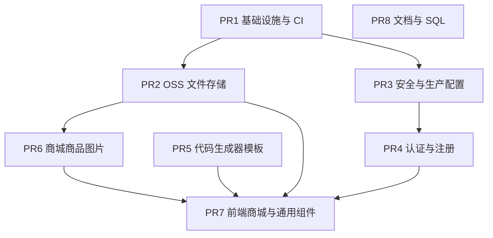

# 大 Diff 拆分 PR 计划

> 基于当前工作区相对默认分支的变更（约 130+ 文件）。  
> **执行前需确认**：先备份工作区，再逐 PR 建分支、按文件清单提交，**不使用 `git add .`**。

---

## 依赖关系

建议合并顺序：**PR1 → PR2 → PR3 → PR4 → PR5 → PR6 → PR7 → PR8**（PR5 可与 PR2–PR4 并行审查）。

---

## PR1：基础设施与 CI

**标题**：新增 CI 流水线与框架核心调整

| 路径 |
|------|
| `.github/workflows/ci.yml` |
| `star-pivot-dependencies/pom.xml` |
| `star-pivot-framework/star-pivot-framework-core/.../GenConstants.java` |
| `star-pivot-framework/star-pivot-framework-core/.../Result.java` |
| `pom.xml`（若有根 POM 变更） |

**验证**：`mvn test`、CI frontend job（vue-tsc + build）。

---

## PR2：OSS 文件存储统一

**标题**：统一文件存储为 OSS 并移除 MinIO

| 路径 |
|------|
| `star-pivot-framework/star-pivot-framework-file/**`（含 `OssClientConfiguration`、`OssUtil`、删除 MinIO 类） |
| `star-pivot-controller/.../CommonUploadController.java` |
| `star-pivot-controller/.../AvatarController.java`（若有变更） |
| `star-pivot-controller/src/main/resources/application.yml`（oss 段） |
| `doc/用户头像功能前后端逻辑文档.md` |

**验证**：`FileUploadIntegrationTest`、`mvn test`。

---

## PR3：安全与生产环境加固

**标题**：生产环境安全校验与异常处理加固

| 路径 |
|------|
| `star-pivot-controller/.../ProdSecurityValidator.java` |
| `star-pivot-controller/src/main/resources/application-prod.yml` |
| `star-pivot-controller/.../GlobalExceptionHandler.java` |
| `star-pivot-framework/star-pivot-security/**` |
| `star-pivot-controller/.../LogAspect.java` |

**验证**：`prod` profile 启动（缺 `CORS_ALLOWED_ORIGINS` 应失败）；ArchUnit 通过。

---

## PR4：认证与用户注册

**标题**：可配置用户注册与限流

| 路径 |
|------|
| `star-pivot-module/star-pivot-system/.../AuthServiceImpl.java` |
| `star-pivot-module/star-pivot-system/.../LoginRateLimitService.java` |
| `star-pivot-module/star-pivot-system/.../SysConfig*` |
| `star-pivot-module/star-pivot-system/.../RegisterConfigResponse.java` |
| `star-pivot-module/star-pivot-system/.../SysConfigKeys.java` |
| `star-pivot-controller/.../AuthAccountController.java` |
| `star-pivot-controller/.../GlobalPermitAllPathProvider.java` |
| `star-pivot-module/star-pivot-system/src/test/**/AuthServiceIntegrationTest.java` |
| `star-pivot-module/star-pivot-system/src/test/**/DataScopeServiceIntegrationTest.java` |
| `star-pivot-ui/src/views/auth/**` |
| `star-pivot-ui/src/api/auth.ts` |
| `star-pivot-ui/src/utils/auth/register-config.ts` |
| `sql/star-pivot.sql`、`sql/star_pivot_dev.sql`（注册相关 config 项） |

**验证**：注册开关开/关、限流、默认角色分配单测。

---

## PR5：代码生成器模板升级

**标题**：代码生成器模板迁移至 ReqBo 与 Mapper 宏

| 路径 |
|------|
| `star-pivot-module/star-pivot-generator/**`（含 `vm/**`、`VelocityUtils.java`、`GenUtils.java`） |
| `doc/生成器模板迁移指南.md` |

**验证**：对测试表执行预览/生成，对照迁移指南检查产物。

---

## PR6：商城商品图片后端

**标题**：商城商品图片上传 API 与 objectName 存库

| 路径 |
|------|
| `star-pivot-module/star-pivot-mall/.../GoodsImageController.java` |
| `star-pivot-module/star-pivot-mall/.../GoodsImageConstants.java` |
| `star-pivot-module/star-pivot-mall/.../PmsSpuInfoServiceImpl.java`（图片字段相关） |
| `star-pivot-module/star-pivot-mall/src/test/**/GoodsImageControllerIntegrationTest.java` |
| `sql/mall_pms.sql`（若有图片字段变更） |

**验证**：mall 模块测试、`mvn -pl star-pivot-mall test`。

---

## PR7：前端商城与通用组件

**标题**：前端商品图预签名 URL 与商城页面更新

| 路径 |
|------|
| `star-pivot-ui/src/api/mall/goods-image.ts` |
| `star-pivot-ui/src/api/mall/image.ts` |
| `star-pivot-ui/src/utils/mall/goods-image-url.ts` |
| `star-pivot-ui/src/utils/storage/oss-object-path.ts` |
| `star-pivot-ui/src/views/mall/**` |
| `star-pivot-ui/src/components/core/media/**` |
| 其它 `star-pivot-ui/**` 非 auth/非 generator 变更 |

**验证**：`pnpm exec vue-tsc --noEmit`、`pnpm build`、商品 SPU 图片上传联调。

---

## PR8：文档、README 与杂项

**标题**：更新架构与依赖文档

| 路径 |
|------|
| `README.md` |
| `doc/架构图与流程图.md` |
| `doc/项目依赖引用梳理.md` |
| `star-pivot-controller/.../StarPivotApplication.java`（若有注释/扫描变更） |
| `star-pivot-ui/src/views/tools/generator/**`（生成器 UI 小改） |

---

## 执行步骤（确认后）

1. 备份：`git stash create "pre-split"` → `git update-ref refs/backup/pre-split-$(date +%s) $SHA`
2. 从 `main`/`develop` 依次建分支 `split/pr1-ci` … `split/pr8-docs`
3. 每个 PR **仅 stage 上表列出的路径**
4. 推送并 `gh pr create --title "…"`（使用上文中文标题），在 PR 描述中链接依赖 PR（如 PR6 依赖 PR2）
5. 原分支保留至全部 PR 合并完成

---

## 不在 PR 中提交

- `logs/`、`*.log`
- `star-pivot-controller/src/main/resources/application-dev.yml`（已在 `.gitignore`）
- `**/target/**`
- 任何含真实 AK/SK 的配置

---

## 待你确认

~~请回复要执行的 PR 范围（例如「全部」或「先做 PR1+PR2」），确认后再建分支与提交。~~

**已于 2026-06-01 执行完成**（堆叠分支，已推送 `github` 与 `origin`）。本地环境未安装 `gh`，请用下方链接手动创建 PR（标题用中文）。

| PR | 分支 | Base | 中文标题 | GitHub Compare |
|----|------|------|----------|----------------|
| 1 | `split/pr1-ci` | `master` | 新增 CI 流水线与框架核心调整 | [创建 PR](https://github.com/xinxin-star1998/star-pivot/compare/master...split/pr1-ci?expand=1) |
| 2 | `split/pr2-oss` | `split/pr1-ci` | 统一文件存储为 OSS 并移除 MinIO | [创建 PR](https://github.com/xinxin-star1998/star-pivot/compare/split/pr1-ci...split/pr2-oss?expand=1) |
| 3 | `split/pr3-security` | `split/pr2-oss` | 生产环境安全校验与异常处理加固 | [创建 PR](https://github.com/xinxin-star1998/star-pivot/compare/split/pr2-oss...split/pr3-security?expand=1) |
| 4 | `split/pr4-auth` | `split/pr3-security` | 可配置用户注册与限流 | [创建 PR](https://github.com/xinxin-star1998/star-pivot/compare/split/pr3-security...split/pr4-auth?expand=1) |
| 5 | `split/pr5-generator` | `split/pr4-auth` | 代码生成器模板迁移至 ReqBo 与 Mapper 宏 | [创建 PR](https://github.com/xinxin-star1998/star-pivot/compare/split/pr4-auth...split/pr5-generator?expand=1) |
| 6 | `split/pr6-mall` | `split/pr5-generator` | 商城商品图片上传 API 与 objectName 存库 | [创建 PR](https://github.com/xinxin-star1998/star-pivot/compare/split/pr5-generator...split/pr6-mall?expand=1) |
| 7 | `split/pr7-ui` | `split/pr6-mall` | 前端商品图预签名 URL 与商城页面更新 | [创建 PR](https://github.com/xinxin-star1998/star-pivot/compare/split/pr6-mall...split/pr7-ui?expand=1) |
| 8 | `split/pr8-docs` | `split/pr7-ui` | 更新架构与依赖文档 | [创建 PR](https://github.com/xinxin-star1998/star-pivot/compare/split/pr7-ui...split/pr8-docs?expand=1) |

**说明**

- 备份 ref：`refs/backup/pre-split-*`（`git stash create` 快照）；工作区 stash：`stash@{0}: pre-split-all`
- 完整代码栈在 `split/pr8-docs`；`master` 保持干净
- PR2 误含 `doc/PR拆分计划.md` 与 `doc/生成器模板迁移指南.md`（原计划 PR5/PR8），不影响功能，可合并后忽略 PR8 中重复 doc 变更
- Gitee PR：将 base 改为对应分支后在 Gitee 新建合并请求即可
