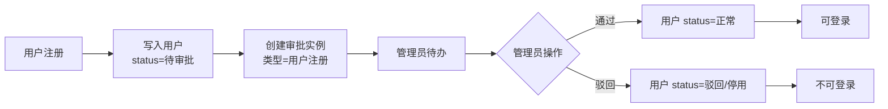
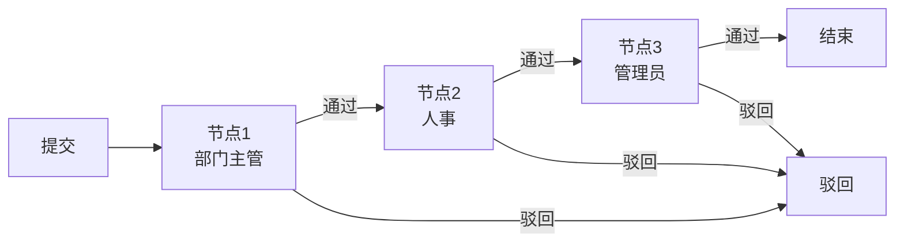
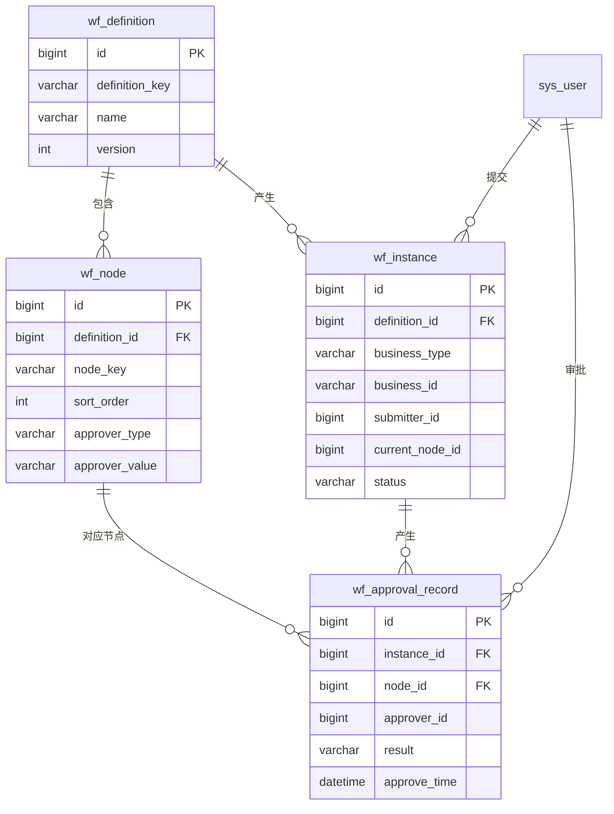

# 审批流程管理模块 - 开发文档

> 本文档描述 StarPivot 审批流程管理模块的业务目标、数据模型、接口设计与实施步骤，支持**用户注册审批**与**按流程图顺序的多级审批**。流程引擎采用 **Flowable**（BPMN 2.0），与 Spring Boot 集成，复用现有 MySQL 数据源。

---

## 1. 概述

### 1.1 业务目标

- **用户注册审批**：用户注册后不直接可用，需管理员（或指定角色）审批通过后，账号才可登录使用。
- **流程化多级审批**：支持按流程图定义的顺序，由不同用户/角色依次审批（如：部门主管 → 人事 → 管理员），直至流程结束。

### 1.2 适用范围

| 场景         | 说明 |
|--------------|------|
| 用户注册审批 | 注册后状态为「待审批」，管理员审批通过后变为「正常」，可登录 |
| 通用流程审批 | 流程定义 + 流程实例 + 节点审批记录，可复用到其他业务（如请假、报销等） |

### 1.3 与现有系统衔接

- **注册流程**：现有 `AuthController.register` 注册成功后，将用户 `status` 改为「待审批」，并可选创建一条「用户注册审批」流程实例，等待管理员审批。
- **登录**：登录时若用户状态为「待审批」，可提示「账号待审批，请联系管理员」并拒绝登录。
- **权限**：审批相关接口与菜单纳入现有 RBAC，使用 `approval` 或 `workflow` 模块前缀。

---

## 2. 技术选型：Flowable

### 2.1 简介

[Flowable](https://www.flowable.com/open-source) 是轻量级、高性能的 BPMN 2.0 工作流引擎，使用 Java 编写，适合嵌入 Spring Boot 应用：

- **标准 BPMN 2.0**：流程用 XML 定义，可用 Flowable Modeler 或 IDE 插件设计流程图。
- **Spring Boot 集成**：`flowable-spring-boot-starter` 自动配置引擎与 REST API（可选）。
- **服务 API**：`RepositoryService`（部署/查询流程定义）、`RuntimeService`（启流程实例）、`TaskService`（待办/签领/完成任务）、`HistoryService`（历史与审计）。
- **用户任务**：User Task 支持 assignee（指定人）、candidateUsers、candidateGroups（与系统角色对接），支持多级顺序审批。

### 2.2 与项目集成要点

| 项 | 说明 |
|----|------|
| 数据源 | 与现有项目共用同一 MySQL，Flowable 使用独立 schema 或表前缀（如 `ACT_`），避免与业务表冲突 |
| 流程定义 | BPMN XML 放在 `src/main/resources/processes/`，启动时自动部署 |
| 业务关联 | 启动实例时传 `businessKey`（如用户 ID）、`variables`（如 initiator、业务类型），便于查询「某用户的注册审批」 |
| 审批人 | User Task 的 candidateGroups 填角色 key（如 `admin`），与 `sys_role.role_key` 对应；或通过 TaskListener 按部门/岗位动态设置 |

---

## 3. 业务流程图

### 3.1 用户注册审批流程（单级管理员审批）



### 3.2 按流程图顺序的多级审批（示例：三级）



- 流程**按节点顺序**依次推进，当前节点审批通过后，下一节点审批人收到待办；任一节点驳回则流程结束（可配置是否回到提交人）。

---

## 4. 基于 Flowable 的实现

### 4.1 Maven 依赖

在 `star-pivot-dependencies/pom.xml` 的 dependencyManagement 中增加 Flowable 版本，在 `star-pivot-controller` 或新建的 `star-pivot-approval` 模块中引入：

```xml
<!-- Flowable 引擎（与 Spring Boot 3 兼容的版本，如 7.0.0+） -->
<dependency>
    <groupId>org.flowable</groupId>
    <artifactId>flowable-spring-boot-starter</artifactId>
    <version>7.0.0</version>
</dependency>
```

如需 REST API（待办/审批接口可自研或复用 Flowable REST），可额外引入 `flowable-spring-boot-starter-rest`。

### 4.2 配置（application.yml）

与现有数据源共用，并指定流程定义路径与表策略：

```yaml
flowable:
  database-schema-update: true
  async-executor-activate: false
  process-definition-location-prefix: classpath*:/processes/
  process-definition-location-suffixes: "**.bpmn20.xml,**.bpmn"
  # 若与业务同库，可使用表前缀区分
  # table-prefix: ACT_
```

- 首次启动时 `database-schema-update: true` 会创建 Flowable 引擎表（ACT_RE_*、ACT_RU_*、ACT_HI_* 等）；生产可改为 `false` 并由 Flyway/Liquibase 管理。

### 4.3 BPMN 流程定义示例

**（1）用户注册审批（单级）**  
文件：`src/main/resources/processes/user-register-approval.bpmn20.xml`

- 流程 id：`userRegisterApproval`（与 startProcessInstanceByKey 的 key 一致）。
- 开始事件 → 用户任务「管理员审批」（candidateGroups=`admin`，与系统管理员角色 key 一致）→ 结束事件。
- 用户任务可通过流程变量 `initiator`（注册用户 ID）、`username` 在业务里查询待审批用户信息。

BPMN 结构示例（仅示意，实际需完整 XML 命名空间与 id）：

```xml
<process id="userRegisterApproval" name="用户注册审批" isExecutable="true">
  <startEvent id="start" />
  <userTask id="adminApprove" name="管理员审批" flowable:candidateGroups="admin" />
  <endEvent id="end" />
  <sequenceFlow sourceRef="start" targetRef="adminApprove" />
  <sequenceFlow sourceRef="adminApprove" targetRef="end" />
</process>
```

**（2）多级顺序审批（示例）**  
流程 id：`multiLevelApproval`。

- 开始 → User Task「部门主管审批」→ User Task「人事审批」→ User Task「管理员审批」→ 结束。
- 每个 User Task 的 candidateGroups 配置为对应角色 key（如 `dept_leader`、`hr`、`admin`），与 `sys_role.role_key` 对应；或使用 TaskListener 在运行时根据部门/岗位解析审批人并 setAssignee。

### 4.4 与业务衔接的 API 用法

| 场景 | 使用方式 |
|------|----------|
| 注册时发起审批 | `runtimeService.createProcessInstanceBuilder().processDefinitionKey("userRegisterApproval").businessKey(String.valueOf(userId)).variable("initiator", userId).variable("username", username).start()` |
| 待我审批列表 | `taskService.createTaskQuery().taskCandidateGroup(roleKey).list()` 或 `.taskAssignee(userId)`，再按 processInstanceId 取流程变量、业务键 |
| 通过/驳回 | `taskService.complete(taskId, variables)`，variables 中放 `approved=true/false`、`comment`；下一节点或网关根据 `approved` 分支，驳回时可结束流程或回退 |
| 审批通过后改用户状态 | 在 User Task 的 ExecutionListener 或 ServiceTask 中注入业务 Service，根据 processInstance.getBusinessKey() 取 userId，更新 sys_user.status 为正常 |

- 流程实例与业务关联：**businessKey** 存业务主键（如用户 ID），**variables** 存 initiator、username、approved、comment 等，便于列表展示与历史查询。

### 4.5 与系统用户/角色对接

- **待办列表按角色**：当前登录用户的角色 key 列表（如 `["admin","hr"]`），用 `taskService.createTaskQuery().taskCandidateGroup("admin").list()` 等合并去重，得到待办任务。
- **签领（Claim）**：若任务配置为 candidateGroup，审批人可先 `taskService.claim(taskId, userId)` 再办理，任务即从组待办变为个人待办。
- **历史与流程图**：`HistoryService` 查询历史活动、`RepositoryService` 取 BPMN 定义，前端可用 Flowable 官方 JS 或 bpmn-js 等渲染流程图并高亮当前节点。

---

## 5. 数据模型设计

采用 **Flowable** 时，流程定义、流程实例、任务、历史由引擎自带的 **ACT_*** 表管理（如 ACT_RE_PROCDEF、ACT_RU_EXECUTION、ACT_RU_TASK、ACT_HI_TASKINST 等），业务侧只需扩展 `sys_user.status` 并与流程实例的 **businessKey** / **variables** 关联。以下为可选自建业务表（若需在业务库中冗余流程摘要时使用）；若完全依赖 Flowable 查询，可仅保留用户状态扩展。

### 5.1 用户状态扩展（与现有 sys_user 衔接）

在 `sys_user.status` 现有取值基础上扩展：

| 取值 | 含义     | 说明 |
|------|----------|------|
| 0    | 正常     | 可登录（沿用现有） |
| 1    | 停用     | 不可登录（沿用现有） |
| 2    | 待审批   | 注册后或流程中，等待审批 |
| 3    | 已驳回   | 审批驳回，不可登录（可选） |

- 常量建议放在 `AppConstants` 或 `approval` 模块常量类中，如 `UserStatus.PENDING_APPROVAL = "2"`。

### 5.2 流程定义表（wf_definition，可选）

| 字段名        | 类型         | 说明 |
|---------------|--------------|------|
| id            | bigint PK    | 主键 |
| definition_key| varchar(64)  | 流程唯一标识，如 user_register、leave_request |
| name          | varchar(128) | 流程名称 |
| description   | varchar(512) | 描述 |
| version       | int          | 版本号 |
| status        | char(1)      | 0启用 1停用 |
| create_by     | varchar(64)  | 创建人 |
| create_time   | datetime     | 创建时间 |
| update_by     | varchar(64)  | 更新人 |
| update_time   | datetime     | 更新时间 |

### 5.3 流程节点定义表（wf_node，可选）

| 字段名          | 类型         | 说明 |
|-----------------|--------------|------|
| id              | bigint PK    | 主键 |
| definition_id   | bigint       | 所属流程定义 id |
| node_key        | varchar(64)  | 节点唯一标识，如 dept_leader、hr、admin |
| node_name       | varchar(128) | 节点名称 |
| sort_order      | int          | 顺序，从小到大表示审批顺序 |
| approver_type   | varchar(32)  | 审批人类型：role / user / dept_leader 等 |
| approver_value  | varchar(256) | 审批人取值，如角色 key、用户 ID、部门 ID |
| allow_reject    | char(1)      | 是否允许驳回 Y/N |
| create_time     | datetime     | 创建时间 |
| update_time     | datetime     | 更新时间 |

- 单级审批：仅一条节点（如 approver_type=role, approver_value=admin）。
- 多级审批：多条节点，按 `sort_order` 依次执行。

### 5.4 流程实例表（wf_instance，可选）

| 字段名          | 类型         | 说明 |
|-----------------|--------------|------|
| id              | bigint PK    | 主键 |
| definition_id   | bigint       | 流程定义 id |
| business_type   | varchar(64)  | 业务类型，如 user_register、leave |
| business_id     | varchar(64)  | 业务主键，如用户 ID、请假单 ID |
| submitter_id    | bigint       | 提交人用户 ID |
| current_node_id | bigint       | 当前待审批节点 id（wf_node.id），为空表示已结束 |
| status          | varchar(16)  | running / approved / rejected |
| submit_time     | datetime     | 提交时间 |
| end_time        | datetime     | 结束时间（通过/驳回） |
| create_time     | datetime     | 创建时间 |
| update_time     | datetime     | 更新时间 |

### 5.5 审批记录表（wf_approval_record，可选）

| 字段名        | 类型         | 说明 |
|---------------|--------------|------|
| id            | bigint PK    | 主键 |
| instance_id   | bigint       | 流程实例 id |
| node_id       | bigint       | 节点 id |
| approver_id   | bigint       | 审批人用户 ID |
| result        | varchar(16)  | approved / rejected |
| comment       | varchar(512) | 审批意见 |
| approve_time  | datetime     | 审批时间 |

### 5.6 实体关系概览（自建表方案）



---

## 6. 接口设计

### 6.1 权限编码规范（模块：approval）

遵循 [权限编码与数据权限规范](./权限编码与数据权限规范.md)，采用 `approval:资源:操作`：

| 权限编码 | 说明 |
|----------|------|
| approval:definition:query | 流程定义查询（列表/详情） |
| approval:definition:add | 新增流程定义 |
| approval:definition:edit | 编辑流程定义 |
| approval:definition:delete | 删除流程定义 |
| approval:instance:query | 流程实例查询（我发起的、待我审批的） |
| approval:instance:submit | 提交流程实例（业务侧调用或注册时自动创建） |
| approval:record:approve | 审批操作（通过/驳回） |
| approval:record:query | 审批记录查询 |

### 6.2 流程定义（Flowable：RepositoryService）

| 方法 | 路径 | 说明 |
|------|------|------|
| GET | /approval/definition/list | 分页查询流程定义（RepositoryService.createProcessDefinitionQuery()） |
| GET | /approval/definition/{id} | 流程定义详情（含 BPMN XML 或部署资源） |
| POST | /approval/definition/deploy | 部署 BPMN（RepositoryService.createDeployment().addClasspathResource(...).deploy()） |

- 流程定义以 BPMN 文件为主，部署后由 Flowable 管理；无需自建 wf_definition CRUD 时可仅保留「部署」与「列表/详情」接口。

### 6.3 流程实例与审批（Flowable：RuntimeService / TaskService）

| 方法 | 路径 | 说明 |
|------|------|------|
| GET | /approval/instance/my-submit | 我发起的实例列表（RuntimeService.createProcessInstanceQuery().startedBy(userId)） |
| GET | /approval/instance/todo | 待我审批的实例列表（TaskService.createTaskQuery().taskCandidateGroup(roleKey) 或 .taskAssignee(userId)） |
| GET | /approval/instance/{id} | 实例详情（RuntimeService + HistoryService，含当前任务、变量、历史活动） |
| POST | /approval/instance/submit | 提交实例：RuntimeService.startProcessInstanceByKey(processKey, businessKey, variables) |
| POST | /approval/record/approve | 审批：TaskService.complete(taskId, variables)，variables 含 approved、comment |

### 6.4 用户注册衔接

- **注册时**（在现有 `AuthServiceImpl.register` 中）：
  - 将 `user.setStatus(UserStatus.PENDING_APPROVAL)`（待审批）。
  - 若启用「用户注册审批」，则调用 `RuntimeService.createProcessInstanceBuilder().processDefinitionKey("userRegisterApproval").businessKey(String.valueOf(userId)).variable("initiator", userId).variable("username", username).start()`，无需自建 wf_instance。
- **登录时**（在认证逻辑中）：
  - 若 `user.getStatus()` 为待审批或已驳回，返回明确提示（如「账号待审批，请联系管理员」），不签发 Token。

可选提供：

- GET `/approval/instance/pending-register`：管理员查看「待审批的注册用户」列表（ProcessInstanceQuery.processDefinitionKey("userRegisterApproval").active()，businessKey 即 userId）。

---

## 7. 前端设计要点

### 7.1 菜单与路由

- 一级菜单：**审批管理**（或「工作流」），权限标识可用 `approval:definition:query` 控制是否显示。
- 子菜单建议：
  - 流程定义（列表 + 新增/编辑，含节点配置）
  - 我发起的
  - 待我审批
  - 审批记录（按实例查历史）
- 若仅做「用户注册审批」，可先做：**待我审批**（列表 + 审批弹窗）、**用户管理**中「待审批用户」入口或独立「注册审批」页。

### 7.2 流程定义配置页（Flowable：BPMN 部署）

- 流程以 BPMN XML 为主：可用 Flowable Modeler、bpmn.io 或 IDE 插件设计，上传或从资源路径部署（RepositoryService.createDeployment().addBytes(...).deploy()）。
- 列表展示已部署的流程定义（ProcessDefinitionQuery），详情可展示 BPMN XML 或使用 bpmn-js 渲染。

### 7.3 流程图展示（可选）

- 列表或详情中可用 **bpmn-js** 或 Flowable 官方 JS 加载 BPMN XML，结合 HistoryService 当前活动/历史活动高亮「当前走到哪一步」。

### 7.4 待办与审批操作

- 待我审批：列表展示业务类型、业务摘要、提交人、提交时间、当前节点（来自 TaskService + 流程变量）；操作「通过」「驳回」打开弹窗（审批意见），提交后调用 `POST /approval/record/approve`（即 TaskService.complete(taskId, variables)）。
- 审批通过后：若为「用户注册」流程，在流程的 ExecutionListener 或 ServiceTask 中根据 businessKey 更新 sys_user.status 为正常；流程自然结束。

---

## 8. 后端模块与包结构建议

- 新建模块：`star-pivot-approval`（或 `star-pivot-workflow`），放在 `star-pivot-module` 下，**引入 flowable-spring-boot-starter**。
- 包结构示例：
  - `com.star.pivot.approval.controller`：流程定义（部署/列表）、实例、待办、审批接口。
  - `com.star.pivot.approval.domain.dto / bo`：查询 DTO、提交/审批 BO（与 Flowable API 映射）。
  - `com.star.pivot.approval.service`：封装 RepositoryService、RuntimeService、TaskService、HistoryService，提供「我发起的」「待我审批」「审批通过/驳回」及用户注册时启动流程。
  - `com.star.pivot.approval.listener`（可选）：User Task 的 TaskListener / ExecutionListener，用于审批通过后更新 sys_user.status、或动态设置 assignee/candidateGroup。
- 资源目录：`src/main/resources/processes/` 下放置 BPMN 文件（如 `user-register-approval.bpmn20.xml`），启动时自动部署。
- `star-pivot-controller` 的 pom 中增加对 `star-pivot-approval` 的依赖。
- 用户注册审批：在 `star-pivot-system` 的 `AuthServiceImpl.register` 中注入 approval 模块的「启动用户注册流程」接口（或发布 Spring 事件，由 approval 模块监听并调用 RuntimeService 启动实例），避免循环依赖时可使用事件或本地 API 抽象。

---

## 9. 实施步骤建议

| 阶段 | 内容 |
|------|------|
| 1. 集成 Flowable | 在 dependencies 与 controller/approval 模块加入 flowable-spring-boot-starter；配置数据源与 process-definition 路径；启动后确认 ACT_* 表创建 |
| 2. BPMN 与部署 | 编写用户注册审批 BPMN（单级 User Task，candidateGroup=admin），放入 processes/ 自动部署；可选多级审批 BPMN |
| 3. 实例与审批 API | 封装 RuntimeService.startProcessInstanceByKey、TaskService 待办/complete；提供「我发起的」「待我审批」、审批接口；扩展用户 status 常量 |
| 4. 用户注册衔接 | 注册时 status=待审批并启动 userRegisterApproval 流程（businessKey=userId）；登录时校验待审批/驳回；管理员待办列表与审批，通过后更新用户 status（Listener 或接口内） |
| 5. 前端页面 | 待我审批列表、审批弹窗、可选流程定义列表与 BPMN 部署、流程图高亮（bpmn-js + 历史活动） |
| 6. 可选增强 | 驳回至提交人、抄送、超时提醒、Flowable REST 直接暴露等 |

---

## 10. 文档与图索引

| 图/表 | 位置 | 说明 |
|-------|------|------|
| Flowable 选型与集成 | §2 | 技术简介、与项目数据源/流程定义/审批人对接 |
| 用户注册审批流程图 | §3.1 | 注册 → 待审批 → 管理员通过/驳回 → 可登录/不可登录 |
| 多级审批流程图 | §3.2 | 按节点顺序依次审批，通过进入下一节点，驳回结束 |
| Flowable 实现 | §4 | 依赖、配置、BPMN 示例、RuntimeService/TaskService 用法、与角色对接 |
| 数据模型与用户状态 | §5 | 用户 status 扩展；自建表为可选，Flowable 使用 ACT_* 表 |
| 权限编码与接口 | §6 | approval:definition、approval:instance、approval:record；接口与 Flowable API 对应 |
| 实施步骤 | §9 | 分阶段开发顺序（Flowable 优先） |

若需导出为 PNG/SVG，可使用支持 Mermaid 的编辑器或 [Mermaid Live Editor](https://mermaid.live/) 打开文档中的代码块渲染后导出。
