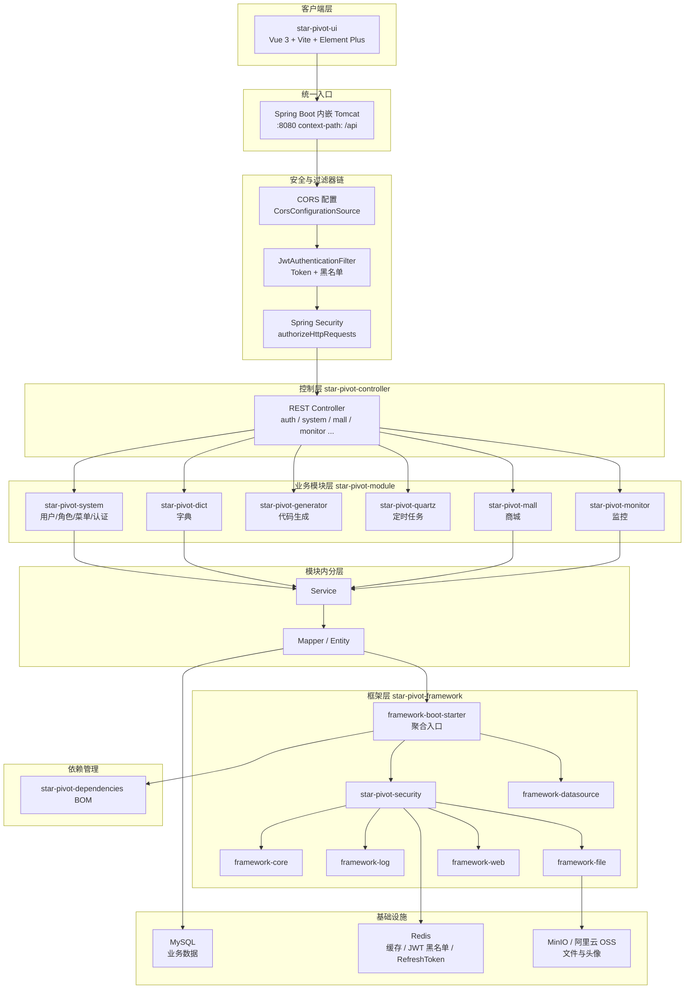
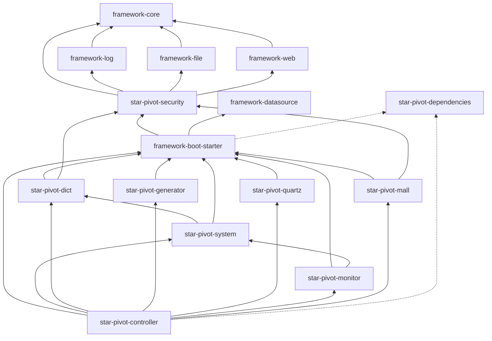
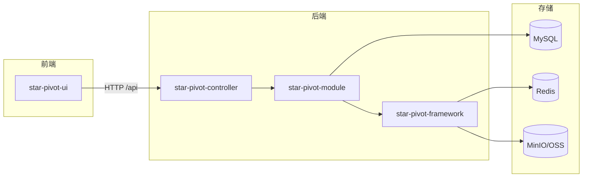
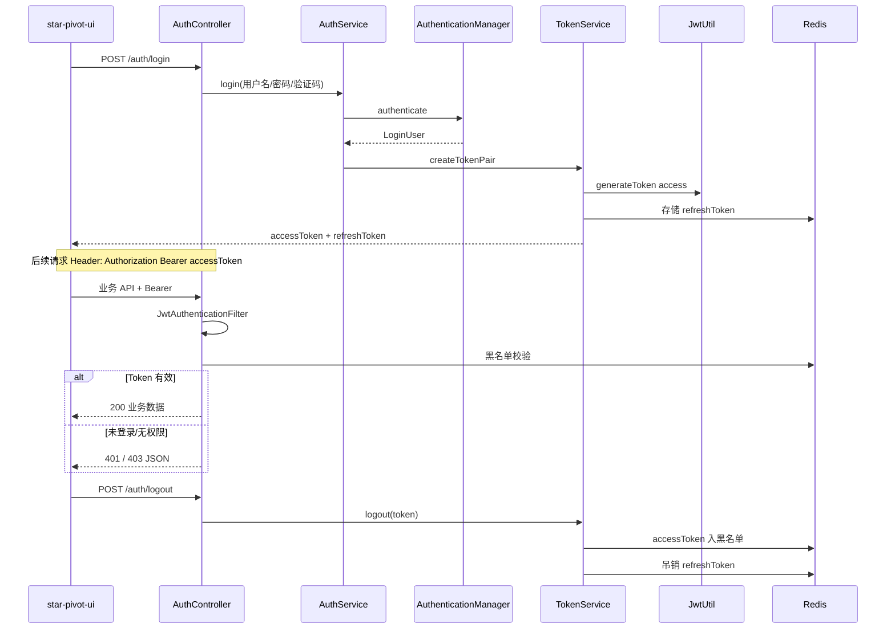
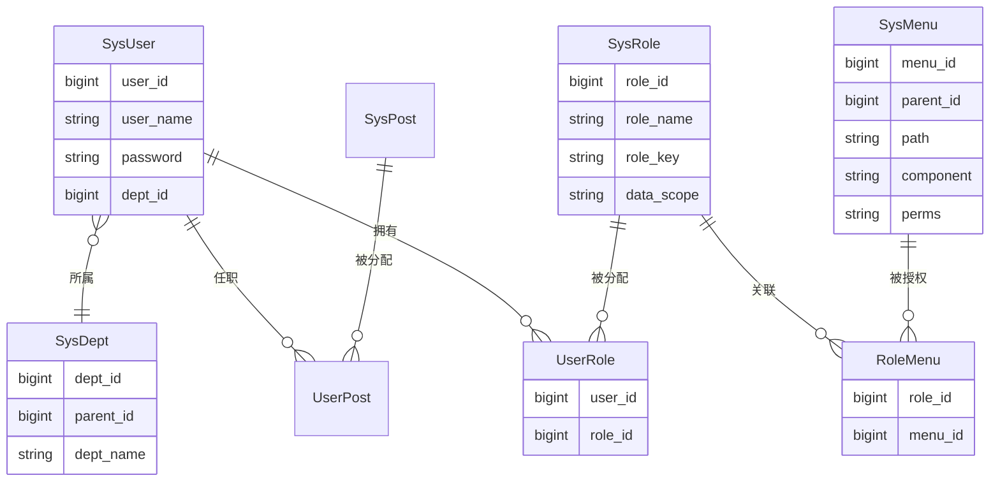
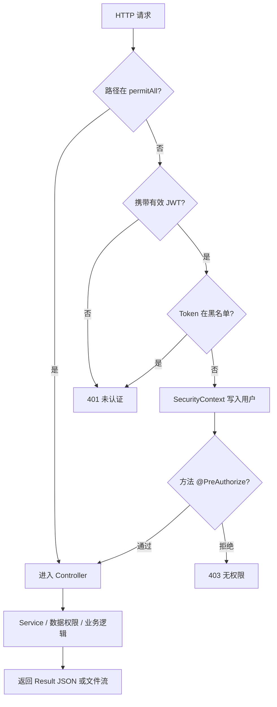
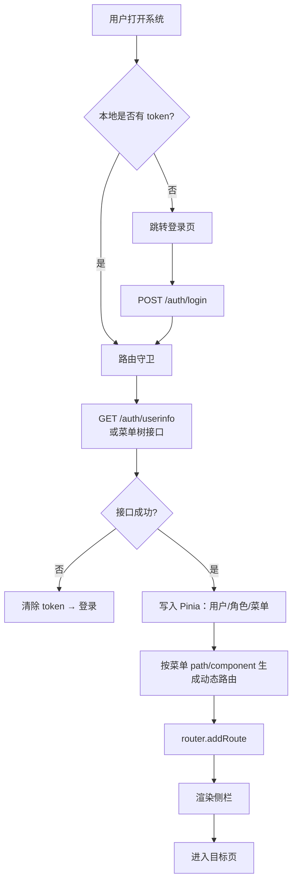
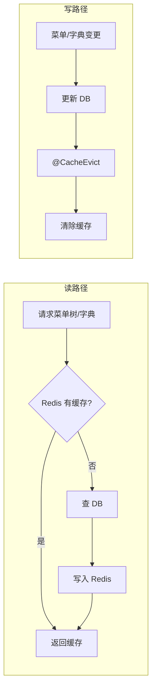

# StarPivot 架构图与流程图

本文档提供分层架构、后端模块依赖、RBAC 模型、认证与前端路由等图示，供开发与评审查阅。

相关文档：

- [`项目依赖引用梳理.md`](项目依赖引用梳理.md) — Maven 模块与 POM 依赖明细  
- [`star-pivot-security-使用说明.md`](star-pivot-security-使用说明.md) — JWT、放行扩展  
- [`权限编码与数据权限规范.md`](权限编码与数据权限规范.md) — 权限码与 DataScope  

---

## 1. 分层系统架构图

从客户端到基础设施的请求路径（与 `star-pivot-controller` + `star-pivot-ui` 部署方式一致）。

说明：

| 层级 | 要点 |
|------|------|
| 客户端 | 仅 `star-pivot-ui` 为仓库内前端；通过 `/api` 访问后端 |
| 安全链 | CORS → JWT 过滤器（含黑名单）→ Spring Security；详见 security 使用说明 |
| 控制层 | **Controller 集中在 controller 模块**，业务逻辑在 module 的 Service |
| 业务模块 | system 依赖 dict；monitor 依赖 system；generator/quartz 已解耦 system |
| 框架层 | 业务侧统一依赖 **boot-starter**；已移除历史模块 `star-pivot-common` |
| 基础设施 | MySQL 持久化；Redis 缓存与令牌；OSS/MinIO 文件 |

---

## 2. 后端模块依赖图

与 [`项目依赖引用梳理.md`](项目依赖引用梳理.md) 一致，展示 **Maven 模块间** 直接依赖（非运行时类依赖）。

**分层约束**：`framework` ← `module` ← `controller`；framework 不依赖任何业务 module。

---

## 3. 系统总体架构（概览）

- **前后端分离**：Vue 3 SPA + Spring Boot REST API。  
- **版本统一**：`star-pivot-dependencies` BOM 管理所有模块与第三方版本。  
- **可执行入口**：仅 `star-pivot-controller` 打可运行 JAR（`StarPivotApplication`）。

---

## 4. 认证与令牌时序

- 登录、刷新、登出接口默认 **匿名放行**（`SecurityConfig` 内置路径）。  
- 登出后 Access Token 进入 Redis 黑名单，Refresh Token 从 `jwt:refresh:user:{userId}` 删除。

---

## 5. RBAC 权限模型关系图

- **用户** ↔ **角色** ↔ **菜单/权限**（`perms` 对应按钮级 `hasAuthority` / `v-auth`）。  
- **数据权限**：角色 `data_scope` + `DataScopeService`，Mapper XML 中 `dataScopeFilter` 片段。  
- 权限编码约定见 [`权限编码与数据权限规范.md`](权限编码与数据权限规范.md)。

---

## 6. 请求处理与权限校验流程

---

## 7. 前端路由与菜单加载流程

- 动态路由来自后端菜单树；按钮显隐使用 `v-auth` / `hasAuth`，与菜单 `perms` 一致。

---

## 8. 缓存与菜单/字典数据流

配置参考 `application.yml` 中 `star-pivot.cache.*`（如 `menu-tree-ttl`、`dict-data-ttl`）。

---

## 9. 文档与图索引

| 图名 | 章节 | 说明 |
|------|------|------|
| 分层系统架构图 | §1 | 客户端 → 安全链 → Controller → 业务模块 → 框架 → 基础设施 |
| 后端模块依赖图 | §2 | Maven 模块直接依赖，与依赖梳理文档一致 |
| 系统总体架构 | §3 | 前后端 + 存储一览 |
| 认证与令牌时序 | §4 | 登录 / 携带 JWT / 登出黑名单 |
| RBAC 权限模型 | §5 | 用户-角色-菜单-部门 |
| 请求与权限校验 | §6 | permitAll → JWT → @PreAuthorize |
| 前端路由与菜单 | §7 | token → userinfo → 动态路由 |
| 缓存与菜单/字典 | §8 | 读缓存 / 写失效 |

| 文字说明文档 | 路径 |
|--------------|------|
| 依赖与模块分层 | [`项目依赖引用梳理.md`](项目依赖引用梳理.md) |
| 安全与 JWT | [`star-pivot-security-使用说明.md`](star-pivot-security-使用说明.md) |
| 权限编码与数据权限 | [`权限编码与数据权限规范.md`](权限编码与数据权限规范.md) |
| EasyExcel 导入导出 | [`通用导入导出使用说明.md`](通用导入导出使用说明.md) |

导出 PNG/SVG：可使用 VS Code Mermaid 插件或 [Mermaid Live Editor](https://mermaid.live/) 打开上述代码块后导出。
