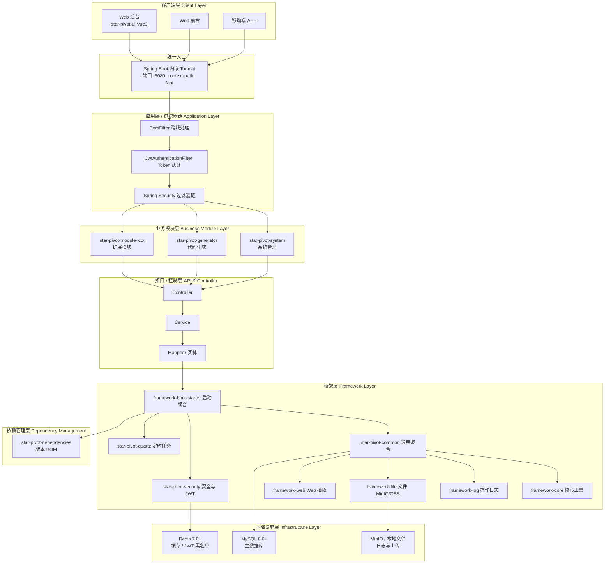
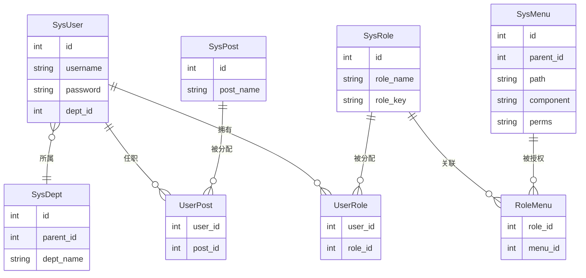
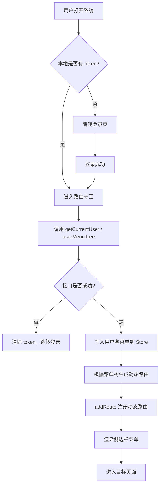
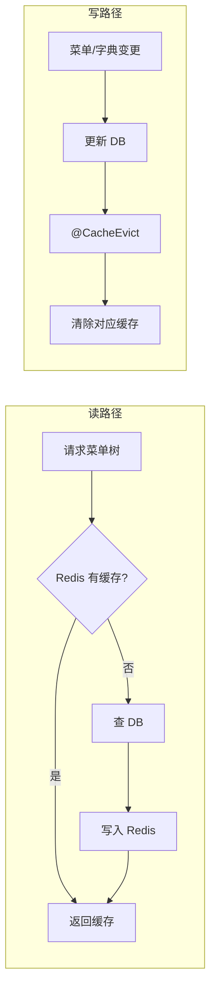

# StarPivot 架构图与流程图

本文档对 [README 第 3 节「架构图与流程图」](../README.md#3-架构图与流程图) 做补充，提供分层架构图、RBAC 权限模型、前端路由与菜单加载等流程图，便于开发与评审时查阅。

---

## 1. 分层系统架构图（从客户端到基础设施）

下图按「客户端 → 过滤器链 → 业务模块 → 接口定义 → 框架层 → 依赖管理 → 基础设施」分层，与常见企业级 Spring Boot 架构图风格一致。

说明：

- **客户端层**：Web 后台（Vue 3）、Web 前台、移动端等，统一通过 Tomcat 端口 8080、前缀 `/api` 访问。
- **应用层**：请求先经 CORS 配置，再经 `JwtAuthenticationFilter` 解析 Token、校验黑名单，最后经 Spring Security 过滤器链。
- **业务模块层**：`star-pivot-system`（用户/角色/菜单/部门等）、`star-pivot-generator`（代码生成），可扩展 `star-pivot-module-xxx`。
- **接口/控制层**：Controller 暴露 REST API，调用 Service 与 Mapper，对应实体与 DTO。
- **框架层**：核心、日志、文件、Web、common 聚合、security、quartz、boot-starter 等，为业务提供通用能力。
- **依赖管理层**：`star-pivot-dependencies` 统一管理依赖版本。
- **基础设施层**：MySQL 持久化、Redis 缓存与 JWT 黑名单、MinIO/本地文件存储。

---

## 2. 系统总体架构（概览）

系统采用前后端分离：**star-pivot-ui**（Vue 3）通过 HTTP 访问 **star-pivot-controller**（Spring Boot），后端依赖 **star-pivot-framework** 与 **star-pivot-module**，数据存储为 MySQL、Redis、MinIO/OSS。详见 README 中的「3.1 系统总体架构图」。

---

## 3. RBAC 权限模型关系图

- **用户 (SysUser)** 通过 **用户-角色 (UserRole)** 关联 **角色 (SysRole)**。
- **角色** 通过 **角色-菜单 (RoleMenu)** 关联 **菜单/权限 (SysMenu)**，菜单的 `perms` 对应按钮级权限。
- 登录后后端返回用户、角色与菜单列表，前端据此生成动态路由与侧栏菜单，并用 `v-auth` 等控制按钮显隐。

---

## 4. 前端路由与菜单加载流程

- 动态路由来源于后端菜单树（`path`、`component` 等），前端在路由守卫中拉取后调用 `router.addRoute()` 注册，再渲染侧边栏。

---

## 5. 缓存与菜单/字典数据流

- 菜单树：`menuTree`，key 如 `'all'`；字典：`dictData`，key 为 `dictType`。变更时使用 `@CacheEvict(allEntries = true)` 或按 key 驱逐。

---

## 6. 文档与图索引

| 图名 | 位置 | 说明 |
|------|------|------|
| **分层系统架构图** | **本文 §1** | **客户端 → 过滤器链 → 业务模块 → 接口 → 框架 → 依赖管理 → 基础设施** |
| 系统总体架构图 | README §3.1 | 用户 → 前端 → 代理 → 后端 → 框架/业务 → 数据存储 |
| 后端模块分层与依赖 | README §3.2 | BOM、controller、module、framework 依赖关系 |
| 认证与授权时序图 | README §3.3 | 登录、携带 JWT 请求、黑名单、登出 |
| 请求处理与权限校验 | README §3.4 | HTTP 请求 → 白名单/JWT → 权限校验 → 业务 |
| RBAC 权限模型 | 本文 §3 | 用户-角色-菜单、部门、岗位关系 |
| 前端路由与菜单加载 | 本文 §4 | 登录态 → 拉取用户/菜单 → 动态路由 → 渲染 |
| 缓存与菜单/字典 | 本文 §5 | 菜单树、字典缓存读写与失效 |

若需导出为 PNG/SVG，可使用支持 Mermaid 的编辑器（如 VS Code 插件）或 [Mermaid Live Editor](https://mermaid.live/) 打开上述代码块渲染后导出。
