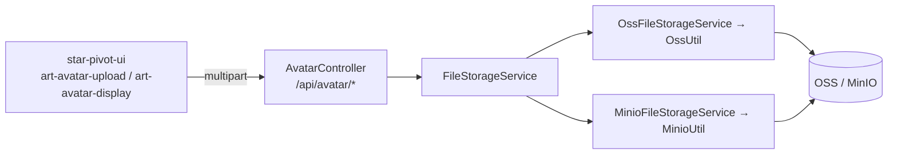
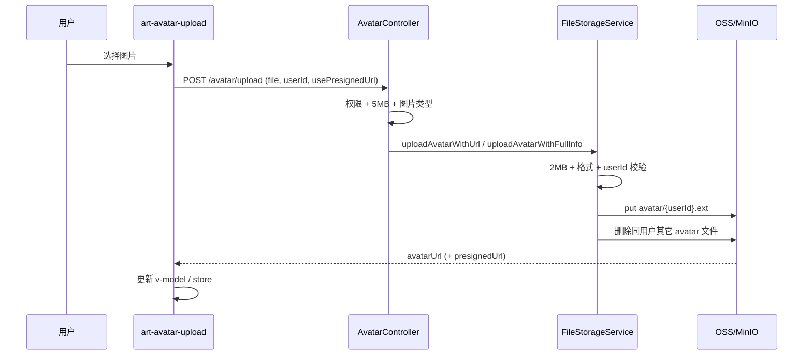

# 用户头像功能前后端逻辑文档

本文档描述用户头像的上传、展示、删除及权限控制，与当前代码实现一致。

相关配置：`application.yml` 中 `file-storage.type`（`oss` | `minio`）决定实际存储实现。

---

## 一、架构概览



| 层级 | 说明 |
|------|------|
| 控制层 | `star-pivot-controller/.../controller/system/AvatarController.java` |
| 存储抽象 | `framework-file/.../storage/FileStorageService.java` |
| 实现 | `OssFileStorageService` / `MinioFileStorageService`（`@ConditionalOnProperty file-storage.type`） |
| 底层工具 | `OssUtil.java`、`MinioUtil.java`（路径、大小、格式、先传后删） |

---

## 二、后端逻辑

### 2.1 头像管理控制器

**路径**：`star-pivot-controller/src/main/java/com/star/pivot/controller/system/AvatarController.java`

**路由前缀**：`/avatar`（完整 URL 为 `/api/avatar/...`）

#### 权限规则（与代码一致）

| 操作 | 本人 | 拥有 `system:user:list` 的管理员 | 超级管理员（`admin` 角色或 `ADMIN_USER_ID`） |
|------|------|----------------------------------|---------------------------------------------|
| 查看他人头像（presigned-url） | — | ✓ | ✓ |
| 上传/删除他人头像 | — | ✗ | ✓ |
| 上传/删除自己的头像 | ✓ | ✓ | ✓ |

说明：

- 超级管理员判定：`AppConstants.ADMIN_USER_ID` 或 `permissionService.hasRole("admin")`。
- 类注释中「不允许查看/修改预置超级管理员头像」：**查看限制已在代码中注释掉**；**修改侧未单独禁止 `ADMIN_USER_ID`**，即另一超级管理员仍可改预置管理员头像（若需禁止需在 `hasPermissionToModifyUser` 中补充）。

#### 接口清单

##### POST `/avatar/upload`

```java
@PostMapping("/upload")
public Result<Map<String, String>> upload(
    @RequestParam("file") MultipartFile file,
    @RequestParam("userId") String userId,
    @RequestParam(value = "usePresignedUrl", defaultValue = "false") boolean usePresignedUrl)
```

| 步骤 | 说明 |
|------|------|
| 大小 | Controller 先校验 ≤ **5MB** |
| 类型 | `Content-Type` 须为 `image/*` 或 `application/octet-stream` |
| 权限 | `hasPermissionToModifyUser(userId)` |
| 存储 | 委托 `FileStorageService` |

**返回示例**：

```json
{
  "code": 200,
  "data": {
    "avatarUrl": "https://bucket.../avatar/123.png",
    "presignedUrl": "https://...?Expires=...",
    "isPresigned": "true"
  }
}
```

| `usePresignedUrl` | 行为 |
|-------------------|------|
| `false` | `uploadAvatarWithUrl` → 仅 `avatarUrl`、`isPresigned=false` |
| `true` | `uploadAvatarWithFullInfo` → 永久 URL（存库）+ 预签名 URL（展示） |

##### GET `/avatar/presigned-url`

```java
@GetMapping("/presigned-url")
public Result<Map<String, String>> getPresignedUrl(@RequestParam("filePath") String filePath)
```

- 从 `filePath` 解析 `userId`（支持 `avatar/{userId}.ext` 与旧格式 `user/{userId}/...`）。
- `hasPermissionToViewUser(userId)` 通过后调用 `fileStorageService.getPresignedUrl(filePath)`。
- 默认有效期约 **7 天**（OssUtil/MinioUtil）。

##### DELETE `/avatar/delete`

```java
@PreAuthorize("isAuthenticated()")
@DeleteMapping("/delete")
public Result<?> delete(@RequestParam("userId") String userId)
```

- 权限：`hasPermissionToModifyUser(userId)`。
- 调用 `fileStorageService.deleteAvatar(userId)`，删除该用户 `avatar/{userId}.*` 下对象。

---

### 2.2 文件存储服务（推荐从此层理解）

**接口**：`star-pivot-framework-file/.../storage/FileStorageService.java`

| 方法 | 用途 |
|------|------|
| `uploadAvatar` | 上传，返回对象路径 `avatar/{userId}.ext` |
| `uploadAvatarWithUrl` | 上传并返回永久 URL（公共桶或存库用） |
| `uploadAvatarWithPresignedUrl` | 上传并返回预签名 URL |
| `uploadAvatarWithFullInfo` | 永久 URL + 预签名 URL（默认方法） |
| `deleteAvatar` | 按 userId 删除头像对象 |
| `getPresignedUrl` / `getPermanentUrl` | 临时/永久访问链接 |

**实现选择**（`application.yml`）：

```yaml
file-storage:
  type: oss   # 或 minio
```

| type | 实现类 |
|------|--------|
| `oss` | `OssFileStorageService` → `OssUtil` |
| `minio` | `MinioFileStorageService` → `MinioUtil` |

---

### 2.3 底层工具类（OssUtil / MinioUtil）

**路径**：

- `star-pivot-framework-file/.../utils/OssUtil.java`
- `star-pivot-framework-file/.../utils/MinioUtil.java`

| 规则 | 值 |
|------|-----|
| **实际上传大小上限** | **2MB**（`AVATAR_MAX_SIZE`，在 Util 层强制） |
| 格式 | JPG、PNG、GIF、WEBP（后缀与白名单校验） |
| userId | 仅允许数字，防路径穿越 |
| 对象路径 | `avatar/{userId}{suffix}` |
| 更新策略 | **先上传新文件，再删除同前缀下其它旧文件** |

> Controller 允许 5MB，但进入 `uploadAvatar` 后仍以 **2MB** 为准；超过 2MB 会报错。文档与联调请以 **2MB** 为上限。

---

## 三、前端逻辑

### 3.1 用户列表

**文件**：`star-pivot-ui/src/views/system/user/index.vue`

- 使用 `ArtAvatarDisplay`，传入列表中的 `user.avatar`。
- 私有桶 OSS/MinIO 永久 URL 在组件内换 presigned 后展示，尺寸约 40px。

### 3.2 用户新增/编辑弹窗

**文件**：`star-pivot-ui/src/views/system/user/modules/user-dialog.vue`

```vue
<art-avatar-upload
  ref="avatarUploadRef"
  v-model="formData.avatar"
  :user-id="formData.userId"
  :size="100"
  :auto-upload="dialogType === 'edit'"
  use-presigned-url
/>
```

| 模式 | 行为 |
|------|------|
| 新增 | `auto-upload=false`，提交创建用户后取 `userId`，再 `uploadImageToServer()` |
| 编辑 | `auto-upload=true`，选图后自动上传 |
| 编辑当前登录用户 | 上传成功后 `userStore.setUserInfo({ avatar, avatarUpdatedAt })` |

### 3.3 头像上传组件

**文件**：`star-pivot-ui/src/components/core/media/art-avatar-upload/index.vue`

- 本地预览、选择文件、删除、延迟上传（`uploadImageToServer`）。
- `usePresignedUrl` 时：私有桶永久 URL 不直接用于 ``，会调 `fetchGetAvatarPresignedUrl`。
- API：`fetchUploadAvatar`、`fetchDeleteAvatar`、`fetchGetAvatarPresignedUrl`（`@/api/user/user`）。

### 3.4 头像展示组件

**文件**：`star-pivot-ui/src/components/core/media/art-avatar-display/index.vue`

- 入参 `avatarUrl`：可为永久 URL、对象路径或 presigned URL。
- 对 `aliyuncs.com` / `.oss-` / `localhost` / `127.0.0.1` 等私有访问场景自动请求 presigned。
- 用于：用户列表、顶部栏、用户中心等统一展示。

### 3.5 用户中心

**文件**：`star-pivot-ui/src/views/system/user-center/index.vue`

- `updateTopAvatarDisplayUrl`：OSS 永久链则 `extractAvatarPathFromUrl` + `fetchGetAvatarPresignedUrl`。
- 顶部大头像与表单内 `art-avatar-upload` 联动。

### 3.6 顶部栏用户菜单

**文件**：`star-pivot-ui/src/components/core/layouts/art-header-bar/widget/ArtUserMenu.vue`

```typescript
const avatarUrl = computed(() => {
  const u = userInfo.value as any
  const url = u?.avatar ?? u?.user?.avatar
  return url && String(url).trim() ? url : defaultAvatarImg
})

const avatarDisplayKey = computed(() => {
  const u = userInfo.value as any
  const v = u?.avatarUpdatedAt ?? u?.user?.avatarUpdatedAt ?? ''
  return `${String(avatarUrl.value)}|${v}`
})
```

- 展示使用 **`ArtAvatarDisplay`**（非裸 ``），`:key="avatarDisplayKey"` 用于头像更新后强制刷新 Popover 内图片。

---

## 四、API 定义（前端）

**文件**：`star-pivot-ui/src/api/user/user.ts`

```typescript
export function fetchUploadAvatar(data: FormData) {
  return request.post({
    url: '/api/avatar/upload',
    data,
    headers: { 'Content-Type': 'multipart/form-data' }
  })
}

export function fetchDeleteAvatar(userId: string) {
  return request.del({
    url: '/api/avatar/delete',
    params: { userId }
  })
}

export function fetchGetAvatarPresignedUrl(filePath: string) {
  return request.get({
    url: '/api/avatar/presigned-url',
    params: { filePath }
  })
}
```

`FormData` 字段：`file`、`userId`、`usePresignedUrl`（可选，字符串 `"true"` / `"false"`）。

---

## 五、类型与 Store

**文件**：`star-pivot-ui/src/types/api/api.d.ts`（命名空间 `Api.Auth`）

```typescript
interface UserInfo {
  user?: {
    userId: number
    userName: string
    nickName: string
    avatar: string
    // ...
  }
  /** 前端扩展：覆盖展示用头像 URL */
  avatar?: string
  /** 前端扩展：头像变更时间戳，用于强制刷新组件 */
  avatarUpdatedAt?: number
}
```

用户列表项等见 `Api.SystemManage` 下相关类型；后端用户实体字段为 `avatar`（`SysUser`）。

---

## 六、流程说明

### 6.1 上传流程



### 6.2 展示流程（私有桶）

1. 数据库存永久 URL 或对象路径。
2. `ArtAvatarDisplay` / `art-avatar-upload` 识别 OSS/MinIO 域名。
3. 提取 `filePath`（如 `avatar/123.png`）。
4. `GET /api/avatar/presigned-url?filePath=...`（带登录态）。
5. 使用返回的 `presignedUrl` 渲染 ``。

公共读桶可直接使用 `avatarUrl`，无需 presigned。

### 6.3 删除流程

1. 前端 `fetchDeleteAvatar(userId)`。
2. 后端校验修改权限 → `deleteAvatar(userId)`。
3. 清空表单 `avatar` 字段（组件内处理）。

---

## 七、安全机制

| 机制 | 实现 |
|------|------|
| 路径穿越 | `userId` 仅数字；对象名固定 `avatar/{userId}.ext` |
| 权限 | 改头像仅本人或超级管理员；看他人头像需本人或 `system:user:list` |
| 文件类型 | 图片后缀白名单 + Controller `image/*` |
| 大小 | **有效上限 2MB**（Util）；Controller 5MB 为外层粗校验 |
| 私有桶 | 库中存永久 URL，展示用 presigned，避免 403 |
| 先传后删 | 新文件成功后再删旧后缀，避免丢头像 |

---

## 八、相关文件索引

### 后端

| 文件 | 说明 |
|------|------|
| `controller/system/AvatarController.java` | REST 接口与权限 |
| `storage/FileStorageService.java` | 存储抽象 |
| `storage/impl/OssFileStorageService.java` | OSS 实现 |
| `storage/impl/MinioFileStorageService.java` | MinIO 实现 |
| `utils/OssUtil.java` / `MinioUtil.java` | 上传/删除/presigned |
| `storage/FileStorageProperties.java` | `file-storage.*` 配置 |

### 前端

| 文件 | 说明 |
|------|------|
| `api/user/user.ts` | 头像 API |
| `views/system/user/index.vue` | 列表头像 |
| `views/system/user/modules/user-dialog.vue` | 编辑上传 |
| `views/system/user-center/index.vue` | 个人中心 |
| `components/core/media/art-avatar-upload/index.vue` | 上传组件 |
| `components/core/media/art-avatar-display/index.vue` | 展示组件 |
| `components/core/layouts/art-header-bar/widget/ArtUserMenu.vue` | 顶栏头像 |
| `types/api/api.d.ts` | `UserInfo` 等类型 |

### 其它文档

- 存储与模块依赖：[`项目依赖引用梳理.md`](项目依赖引用梳理.md)（`framework-file`）
- 接口鉴权：[`star-pivot-security-使用说明.md`](star-pivot-security-使用说明.md)

---

## 九、联调检查清单

- [ ] `file-storage.type` 与当前环境一致（本地 dev 常为 `minio`）
- [ ] 上传文件 **≤ 2MB**，格式为图片
- [ ] 私有桶场景前端开启 `use-presigned-url`，列表/顶栏使用 `ArtAvatarDisplay`
- [ ] 跨用户查看头像：调用方具备 `system:user:list` 或查看本人
- [ ] 替他人改头像：仅超级管理员；普通管理员在用户管理里只能改自己的头像
- [ ] 新增用户：先创建用户拿到 `userId` 再上传头像
